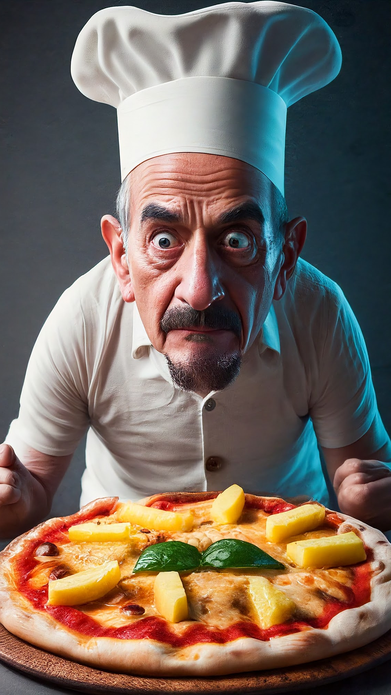
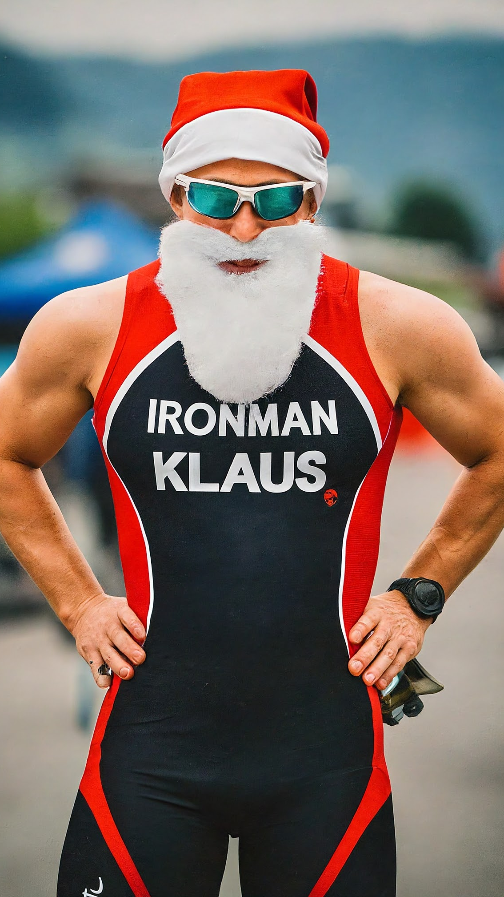
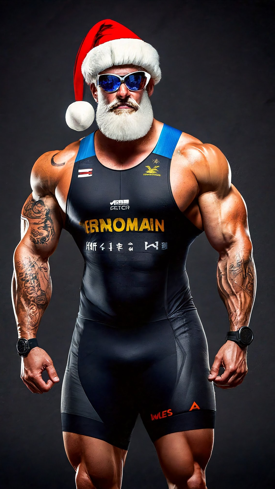

This can be considered the second hello world with images.

This is a cleaner version of <https://github.com/palladius/sakura/blob/master/bin/immagina>
from palladius@ personal repo.

* Read the docs in from: <https://cloud.google.com/vertex-ai/docs/generative-ai/image/generate-images>
* Have gcloud installed, project_id selected, billing enabled, ..
* Execute the script.

As of 4feb24, I've updated the script and now it uses `imagen2` model. Wow!

## A pizza with pineapple cooked by a tormented Italian chef

## Santa Klaus is a triathlete, on Santa Klaus chest you can read: Ironman Finland / Switzerland

Let's also test text writing.

* Ironman Switzerland:

* But then I thought, wouldn't it be funny if he ran for Finland?

