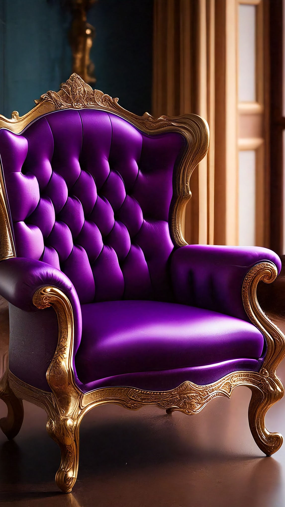
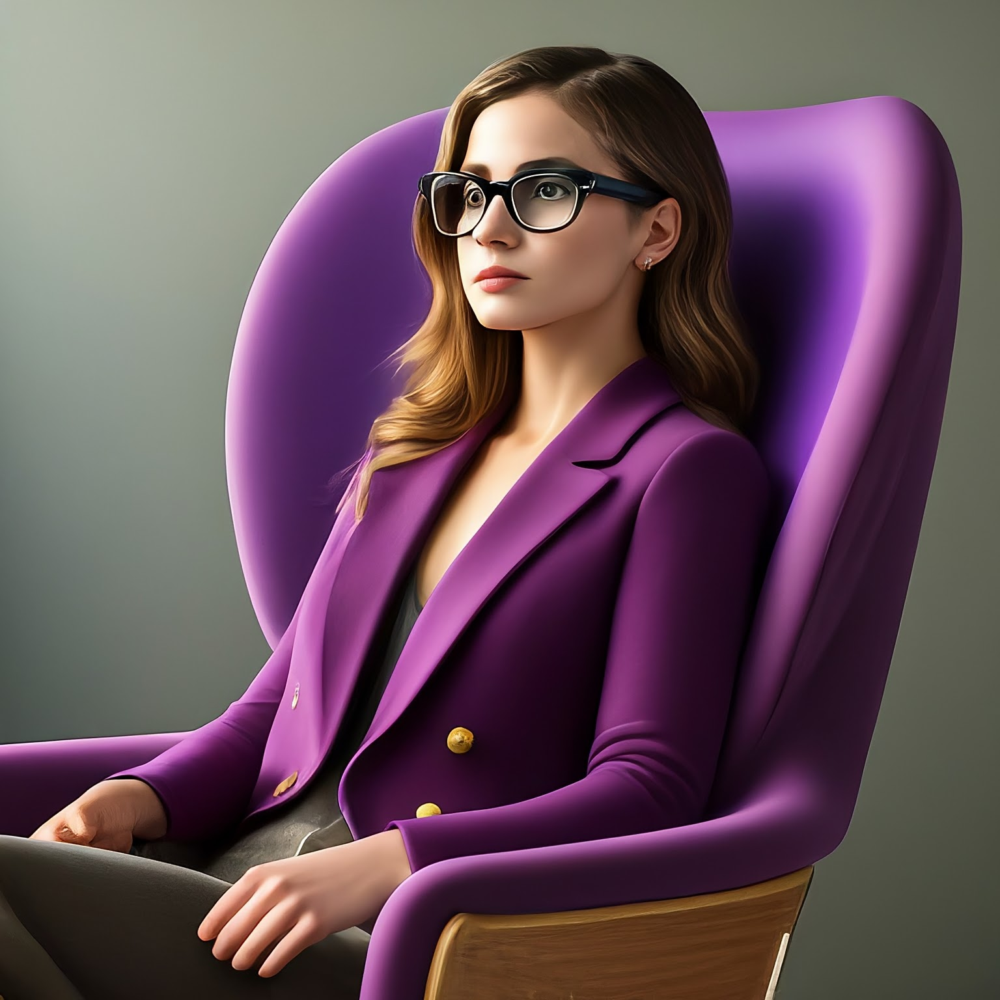

This can be considered the second hello world with images.

This is a cleaner version of <https://github.com/palladius/sakura/blob/master/bin/immagina>
from palladius@ personal repo.

* Read the docs in from: <https://cloud.google.com/vertex-ai/docs/generative-ai/image/generate-images>
* Have gcloud installed, project_id selected, billing enabled, ..
* Execute the script.

**Note**. As of 4feb24, I've updated the script and now it uses `imagen2` model. Wow! It now tkes around 13sec to run it, but quality increased from 1024 to 1536.

## A pizza with pineapple cooked by a tormented Italian chef

Prompt as in title:


## Santa Klaus is a triathlete, on Santa Klaus chest you can read: Ironman Finland / Switzerland

Let's also test text writing.

* Ironman Switzerland:


* But then I thought, wouldn't it be funny if he ran for Finland?


## magazine style, 4k, photorealistic, modern purple armchair, natural lighting. Sitting on the chair, a person wearing glasses

```PROJECT_ID=ricc-genai FILENAME='purple-chair' ./images-generate.sh  'magazine style, 4k, photorealistic, modern purple armchair, natural lighting.'```

Note I took the prompt from [official docs](https://cloud.google.com/vertex-ai/docs/generative-ai/image/generate-images).



Note that adding a person was hard. Plenty of "policy violations" for innocents prompts.
I've also moved the ration from 16:9 to 1:1.

```PROJECT_ID=ricc-genai FILENAME='purple-chair' ./images-generate.sh  'magazine style, 4k, photorealistic, modern purple armchair, natural lighting. Sitting on the chair, a person wearing glasses'```


