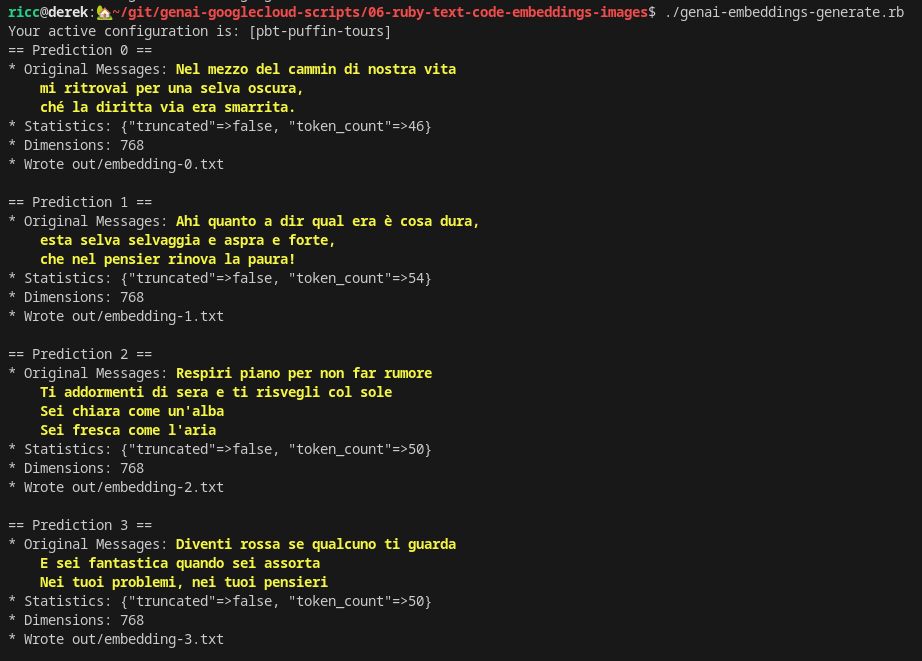

This is Ruby code created thanks to the help of @dazuma (or should I say he wrote two of those,
and I extended to the other 2 :P).

This is a *de facto* Ruby rewrite of folders 01 and 02.

## Prerequisites

* You need to have a Google Cloud active account (billing enabled).
* You need to have `gcloud` and `ruby` installed locally. To overcome some of these, you
  can simply use [Cloud Shell](https://cloud.google.com/shell), which is a very popular alternative.

## Code generation

Usage: `PROJECT_ID=your-gcp-project ./genai-code-generate.rb `

Observe code Input provided by user and output provided by LLM:
```

##############################################################################
# input code to complete, verbatim in the `./genai-code-generate.rb` script.
##############################################################################

def reverse_string(s):
    return s[::-1]
def test_empty_input_string()

##############################################################################
# output script, in file out/code-1.txt
# Note it completes the last string input so the indentation is spot on!
##############################################################################

    assert reverse_string("") == ""
def test_one_character_string()
    assert reverse_string("a") == "a"
def test_two_character_string()
    assert reverse_string("ab") == "ba"
```

## Embedding generation and crunching

1. Create the embeddings via `PROJECT_ID=your-gcp-project ./genai-embeddings-generate.rb`




