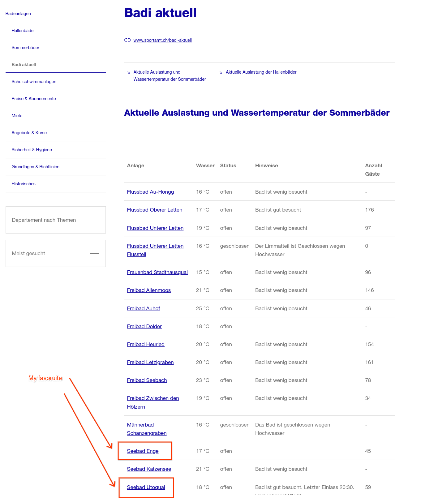

# RAG example

# The problem
I like to swim. However, in Zurich, water temperature can be a bit off for most tastes (not my friend Yves, he likes it
16 degrees). I like it from 20deg on.

Problem is, Switzerland exposes water temperatures in multiple websites, but it doesn't expose an API.

# The Solution

I'm too lazy to build a deterministic one, how about I ask Gemini to do the magic mojo for me? I'll use a RAG pattern
to do so.

The scripts do the following:

* curl information from a swiss website, say https://www.stadt-zuerich.ch/ssd/de/index/sport/schwimmen/wassertemperaturen.html
* feed this curl into a RAG ruby ERB template (JINJA python equivalent, just better ;) ).
* Ask `Gemma` to read this and produce an output.


## Result

These are the two closest beaches to my apartment. Thanks Gemma!

```
$ ./wasser-temperatur-rag.rb
...
$ cat output.json
{
    "Seebad Enge": "17°C",
    "Seebad Utoquai": "18°C"
}
```



## Some additional thoughts

**Why Gemma?** This processing is so simple I don't need Gemini to solve it. Once it gets a bit more complex, of course
I'd resort to Gemini to do this. Something more complex like: ```read this whole article ({{rag}}). What do you reckon is the average sea temperature for Zurich see? Explain your reasoning```. For a task like this, I'd definitely use Gemini 1.5.
Maybe I would also feed a visual map of it.

Also, gemma is much slower than a Gemini API call.

## Next steps

The sky is the limit, ot actually, the Clouds are the limit :)

My next idea would be to feed a monitoring tool once a minute or once an hour depending of the overhead you want to
tolerate. Say the LLM makes a mistake every N times, you have a robust enough signal to get the real number (since water
temperature data really changes once a day - _O(1 day)_) and - more interestingly - we can calculate the reliability of
this algorithm. Is it 99%? 80%? Let's see!

# RAG one-liners

If your RAG is so simple it fits in a pipe, you can do this:

* you have a page with the info you want.
* You have a very simple questions to ask.

Solution:

```
$ 	./curlit.rb https://www.boot24.ch/chde/service/temperaturen/zugersee/ | ollama run gemma Tell me the current water temperature of Zuger See
The current water temperature of Zuger See is **17°C**.
```


Bingo!
