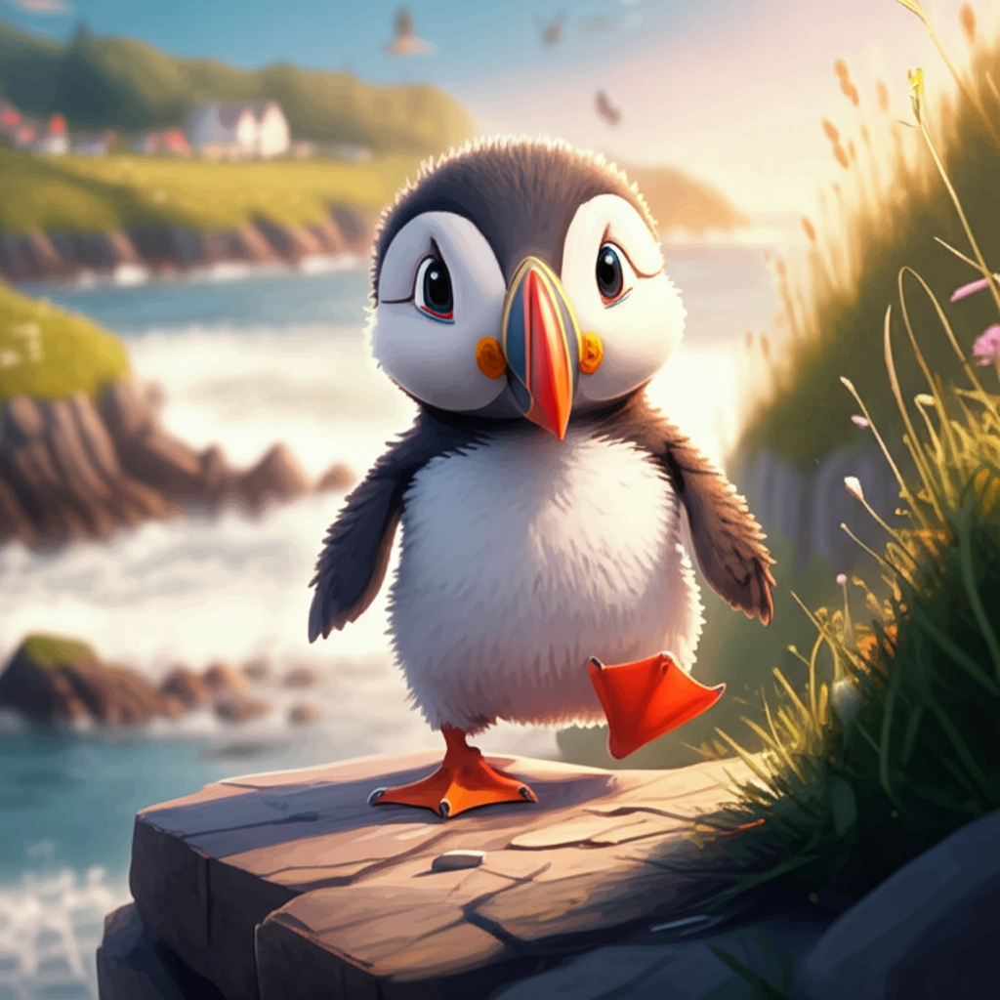
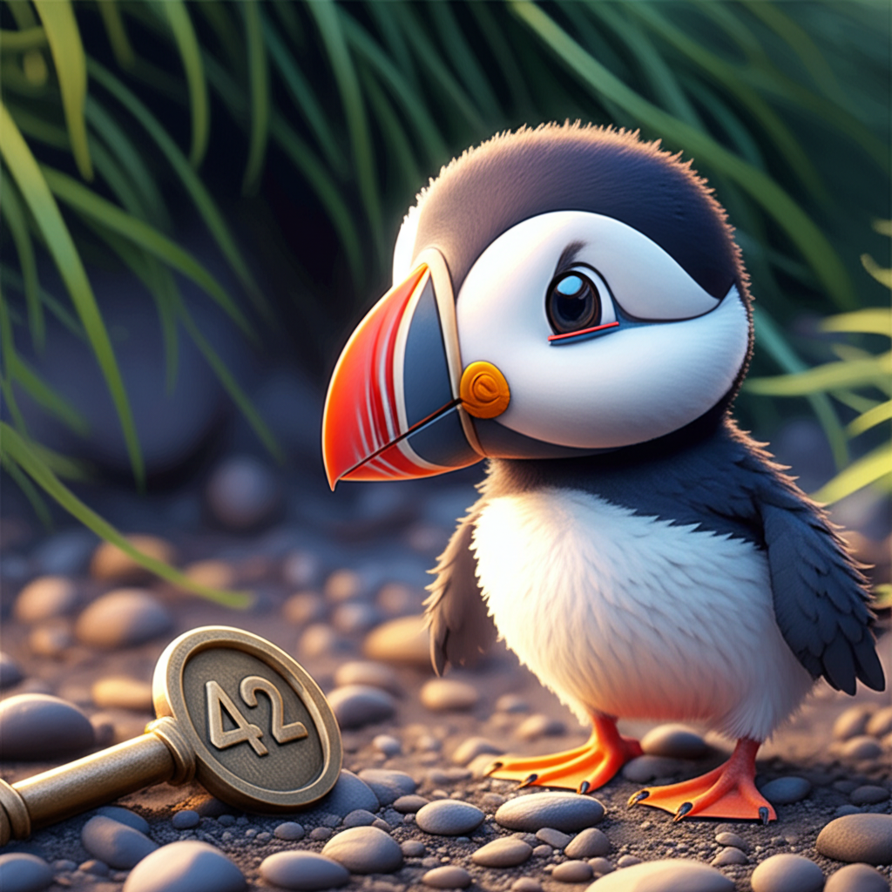
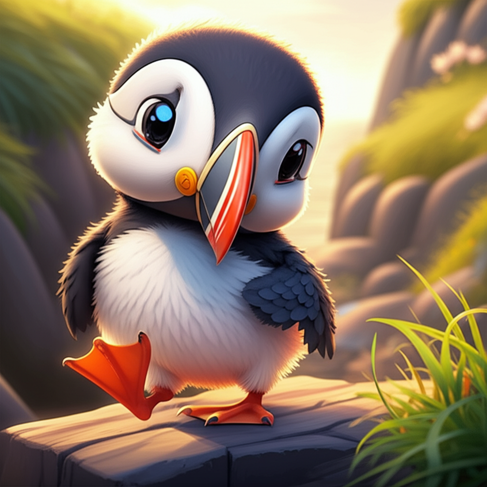
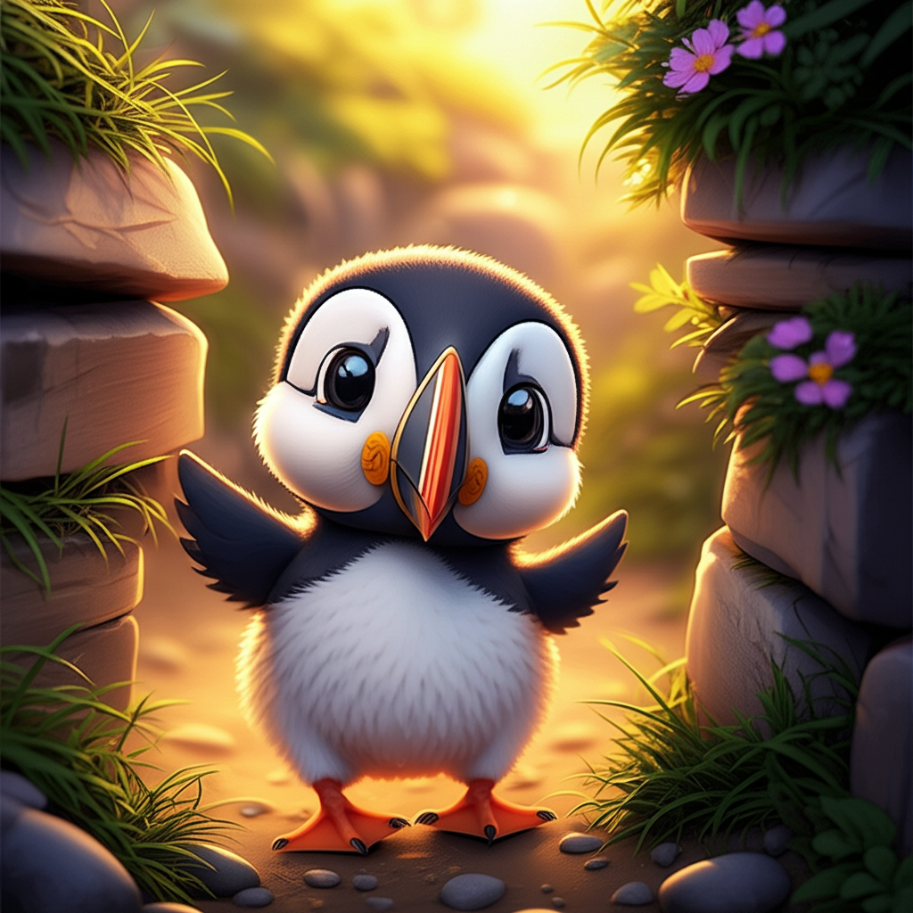
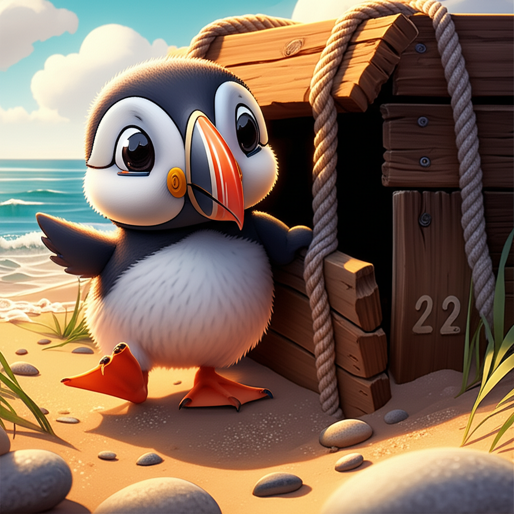
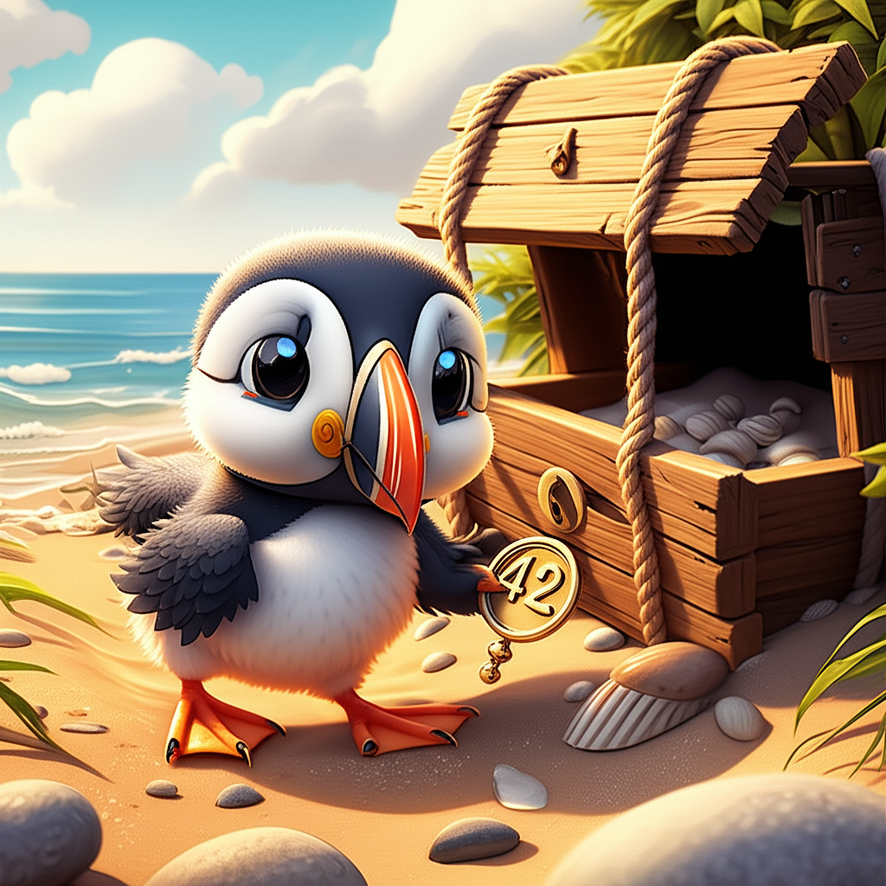

# Text&Image Story Generation Tool - 20250313-0949-puffin-story

**Prompt:** Generate a story about a cute baby puffin in a 3d digital art style who finds a key to the number 42. For each scene, generate an image.

## Chapter 1

## Pip and the Peculiar Key

**Scene 1:**

**Story:** Pip was a particularly fluffy puffin chick, barely out of his downy phase. His tiny wings fluttered with the boundless energy of a newborn, and his bright blue eyes, wide with curiosity, scanned the rocky coastline. He waddled on oversized orange feet, exploring the nooks and crannies near his burrow. The salty air filled his tiny lungs, and the cries of the adult puffins echoed around him. Today felt different, somehow…

**Scene 2:**

**Story:** While pecking at a particularly interesting-looking pebble, Pip’s beak nudged something metallic. He blinked, tilting his head. It was a small, tarnished brass key, unlike anything he had ever seen. It lay half-buried in the sand and pebbles, glinting faintly in the sunlight. Intrigued, Pip nudged it again, then carefully picked it up in his tiny beak. It felt surprisingly heavy.

**Scene 3:**

**Story:** As Pip held the key, he noticed something peculiar etched onto its flat head. Two numbers, side by side: "42". He squinted, his brow furrowing in avian concentration. What could these strange symbols mean? He tried to ask his parents, squawking and presenting the key, but they were busy fishing and didn't seem to understand his frantic chirps.

**Scene 4:**

**Story:** Undeterred, Pip decided to investigate on his own. He waddled along the coastline, the key clutched tightly in his beak. He tried fitting it into cracks in the rocks, hoping it might open some secret passage. He even tried poking it into the burrow of a grumpy-looking rabbit, who just twitched his nose in annoyance. The key didn't seem to fit anywhere.

**Scene 5:**

**Story:** Exhausted but still curious, Pip found himself near an old, weathered wooden crate that had washed ashore. It was partially buried in the sand, covered in barnacles. On its side, barely visible beneath layers of grime and seaweed, were faint, faded numbers: "42". Pip’s eyes widened. Could it be? He hopped closer, his little heart fluttering with excitement.

**Scene 6:**

**Story:** With all his might, Pip wiggled the key into the rusty lock of the crate. It was a tight fit, but with a satisfying click, the lock sprang open! Pip tumbled backwards in surprise as the lid creaked open, revealing… nothing but sand and a few empty seashells. Pip blinked, a little deflated. What was so special about this empty crate?

**Scene 7:**

**Story:** Just as disappointment started to set in, a wise old seagull landed nearby. He watched Pip with knowing eyes. "Well now, little one," he croaked, "sometimes the journey of finding is more important than what you find at the end. You were curious, persistent, and you solved a little mystery. That's quite an adventure for a fluffy chick like you." Pip looked at the key in his beak, then at the empty crate, a slow understanding dawning in his bright blue eyes.

