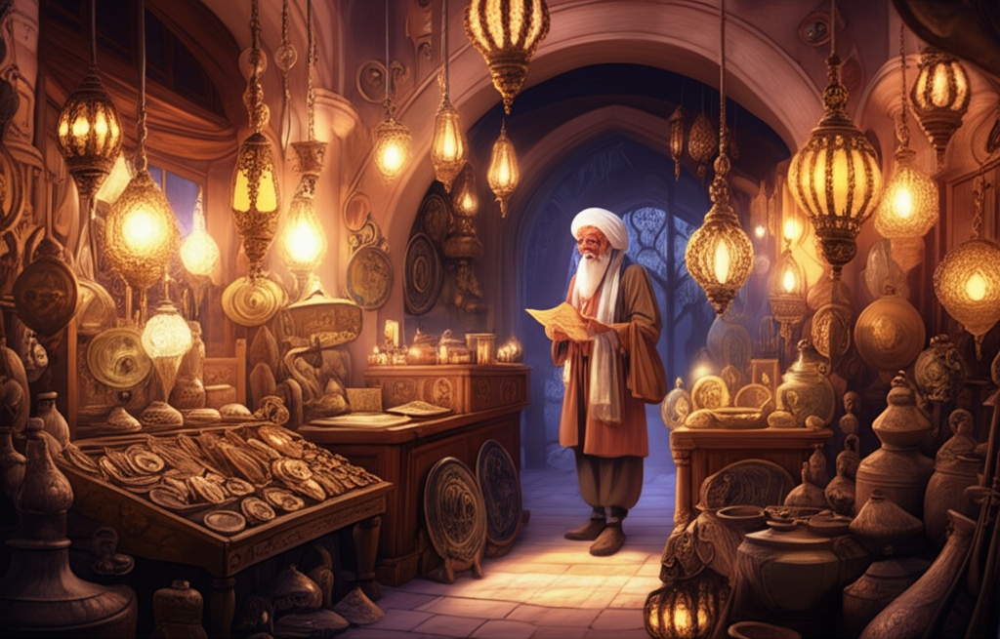
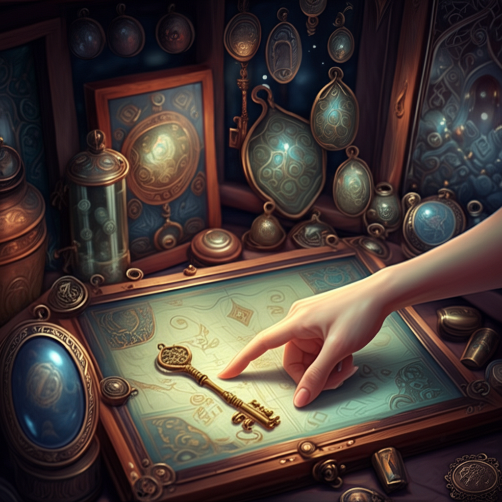
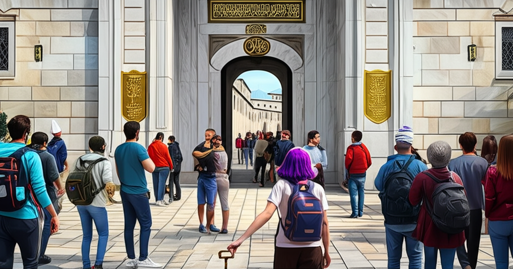

# Text&Image Story Generation Tool - 20250313-0954-da-story

**Prompt:** Generate a story about a Googler in Istanbul in a 3d digital art style who finds a key to Istanbul Topkapi. For each scene, generate an image.

## Chapter 1

## The Sultan's Glitch

**Scene 1:**

A young woman with vibrant purple hair, wearing a Google t-shirt and comfortable travel pants, stands amidst the bustling spice market in Istanbul. Sunlight filters through the colorful awnings, illuminating piles of fragrant spices and Turkish delights. Her name is Anya, a software engineer on a sabbatical, exploring the city's vibrant culture. She clutches a digital map on her phone, a slight frown on her face as it flickers erratically.

**Scene 2:**

Frustrated by the unreliable GPS signal within the ancient market walls, Anya ducks into a dimly lit, antique-filled shop tucked away in a corner. Dusty lamps cast long shadows on shelves overflowing with Ottoman-era artifacts. The shopkeeper, a wizened man with a long white beard, smiles knowingly at her technological woes.

**Scene 3:**

As Anya browses a collection of old keys displayed in a glass case, her fingers brush against a particularly ornate, tarnished bronze key. It feels strangely warm to the touch. Suddenly, her phone, which had been dead, flickers back to life, displaying a single, cryptic notification: "Topkapi Access Granted." Anya stares at the screen, bewildered. The antique key in her hand seems to pulse faintly.

**Scene 4:**

Intrigued, Anya finds herself standing before the majestic gates of Topkapi Palace. Tourists mill about, waiting in line to enter. Hesitantly, she holds up the bronze key. As it gets closer to the ancient wood and iron of the gate, a faint golden light emanates from the keyhole. A soft click echoes through the courtyard. The massive gate creaks open slightly, just enough for her to slip through unnoticed amidst the crowd.

**Scene 5:**

Inside the palace grounds, Anya wanders through opulent courtyards and intricately tiled halls, areas clearly marked "No Entry" for regular visitors. The bronze key, held loosely in her hand, seems to hum gently as she passes by hidden doorways and locked chambers. The digital art style emphasizes the grandeur of the Ottoman architecture, with sharp details and rich textures.

**Scene 6:**

Anya finds herself in a secluded, circular chamber. In the center rests a simple, unmarked wooden chest. The bronze key glows brightly as she approaches. With a deep breath, she inserts the key into the lock. A soft click, and the chest opens, revealing not gold or jewels, but a single, ancient leather-bound book.

**Scene 7:**

Back in her modern Istanbul apartment, Anya pores over the ancient book. Its pages are filled with elegant Ottoman script and intricate diagrams that look strangely familiar to her coding background. As she touches a specific symbol, her laptop screen flickers to life, displaying a complex algorithm overlaid on a map of Topkapi Palace. The "Topkapi Access Granted" notification reappears, now accompanied by a string of code.

