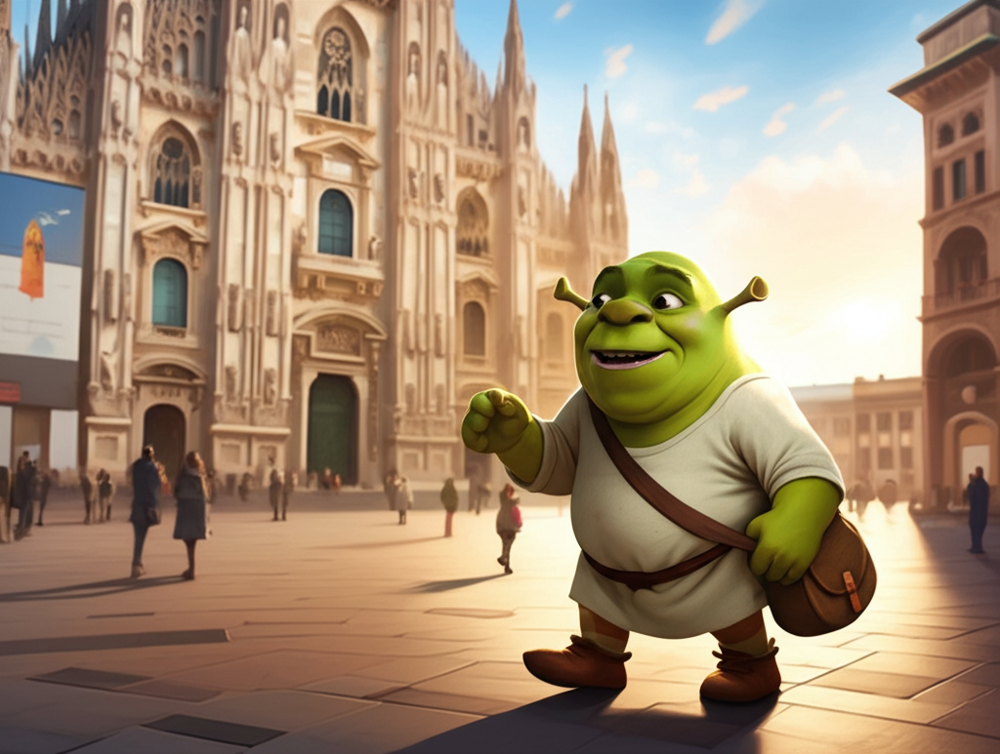
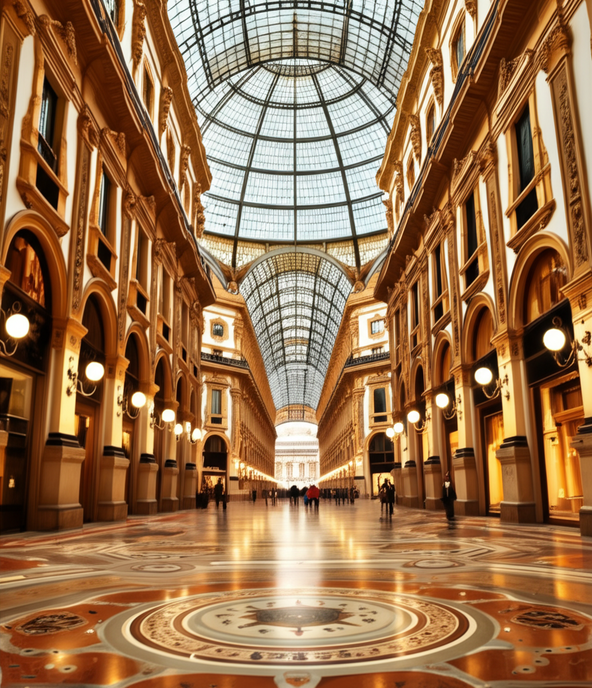
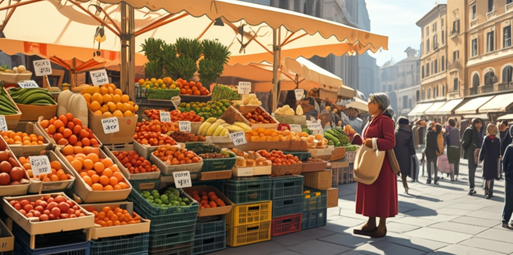
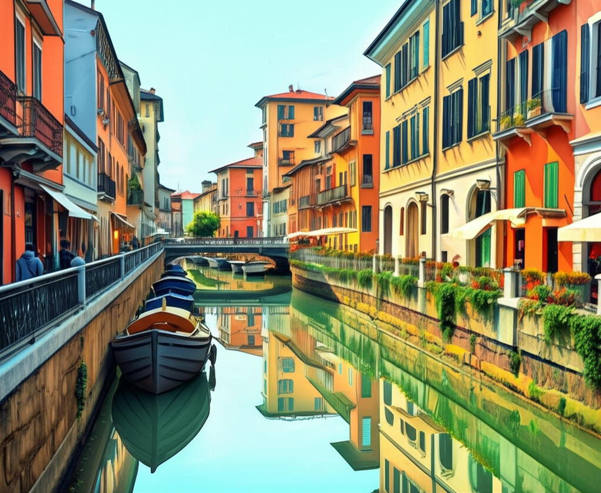
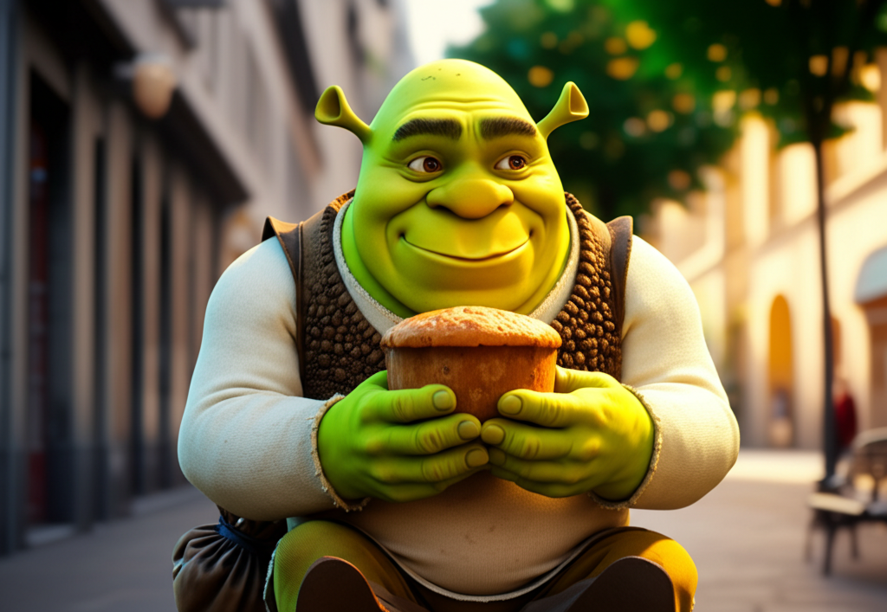

# Text&Image Story Generation Tool - 20250313-1418-babyshrek-milan

**Prompt:** Generate a story about a cute little Shrek in a 3d digital art style, walking around Milan and looking for the perfect Panettone. For each scene, generate an image.

## Chapter #0 1

## Shrek in Milan: A Panettone Pilgrimage

**Scene 1:**

Our adventure begins! Picture a miniature, undeniably cute Shrek – think big, innocent green eyes, slightly smaller tusks that give him a perpetually surprised expression, and a tiny, worn satchel slung across his shoulder. He stands at the Piazza del Duomo in Milan, the towering cathedral a magnificent backdrop to his diminutive figure. He gazes up at the intricate spires, a mix of awe and determination on his little green face. The morning sun casts long shadows, highlighting the cobblestones beneath his surprisingly shiny, little brown boots.

**Scene 2:**

Little Shrek ventures into the Galleria Vittorio Emanuele II. The ornate glass ceiling and the mosaic floors are a dizzying spectacle. He peers into the windows of high-fashion boutiques, his brow furrowed in concentration. He isn't interested in the latest designer bags, though. His gaze is fixed on the bakeries lining the arcade, their windows displaying stacks of golden, dome-shaped Panettone of all sizes. He presses his little green nose against the glass, taking a deep sniff, his eyes widening slightly.

**Scene 3:**

Our little green gourmand finds himself in a bustling open-air market. Colorful produce overflows from the stalls, and the air is thick with the aroma of fresh herbs and cheeses. But Shrek is laser-focused. He navigates through the crowd, his short legs pumping, until he reaches a stall piled high with various types of Panettone. He looks up at the vendor, a kindly old woman with flour dusting her apron, and points a chubby green finger at a particularly tall and golden loaf.

**Scene 4:**

After much deliberation (and perhaps a tiny taste test offered by a generous baker), little Shrek finally makes his choice. He proudly carries a small, beautifully wrapped Panettone almost as big as his torso. He strolls along a charming canal in the Navigli district, the colorful buildings reflecting in the water. A satisfied smile stretches across his green face. The perfect Panettone has been found!

**Scene 5:**

Our story ends with little Shrek finding a cozy spot in a small park, perhaps overlooking the Sforza Castle in the distance. He sits cross-legged on a bench, carefully unwrapping his precious Panettone. His eyes gleam with anticipation as he takes a big bite. Crumbs dot his little green chin, but he doesn't care. He has found the perfect taste of Milan, and for a moment, this little ogre is in pure, Panettone-induced bliss.

