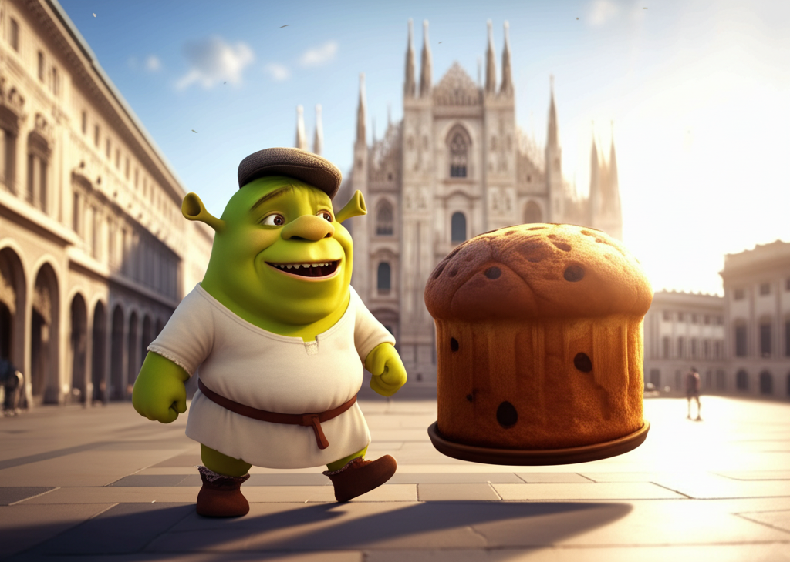
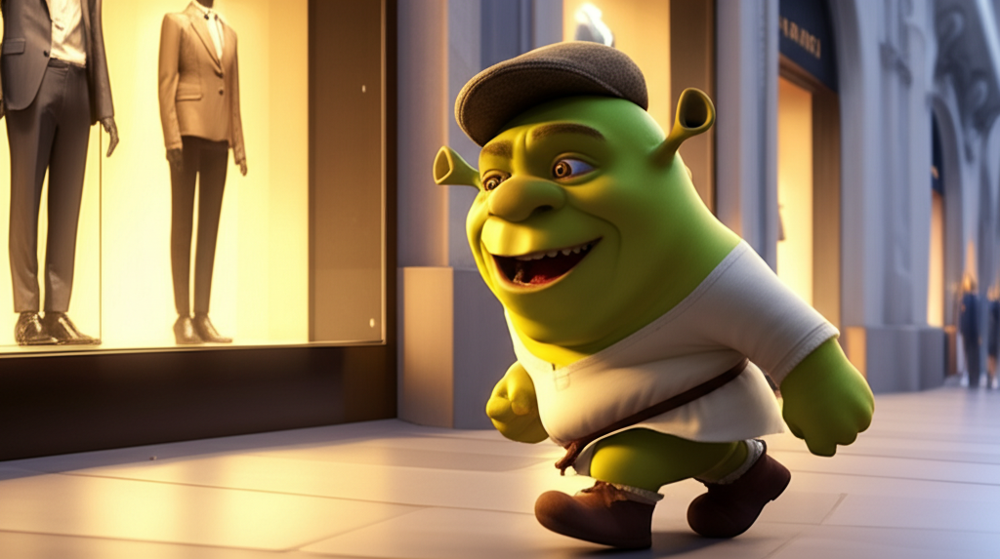
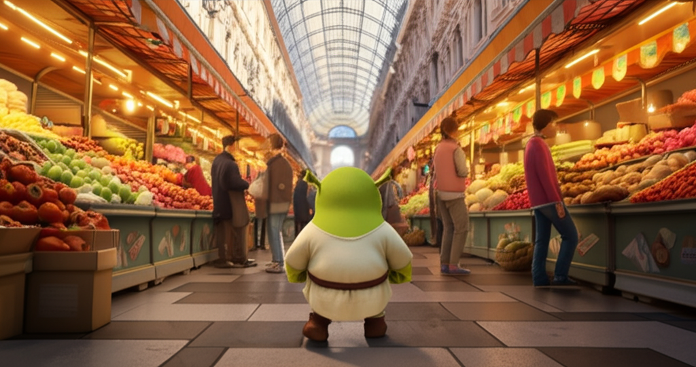
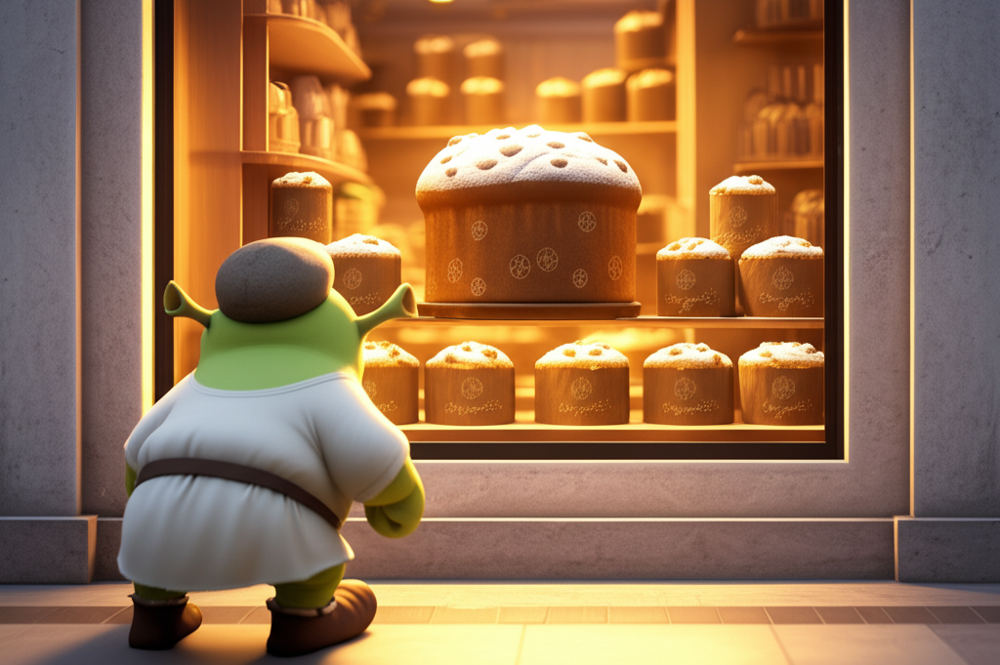
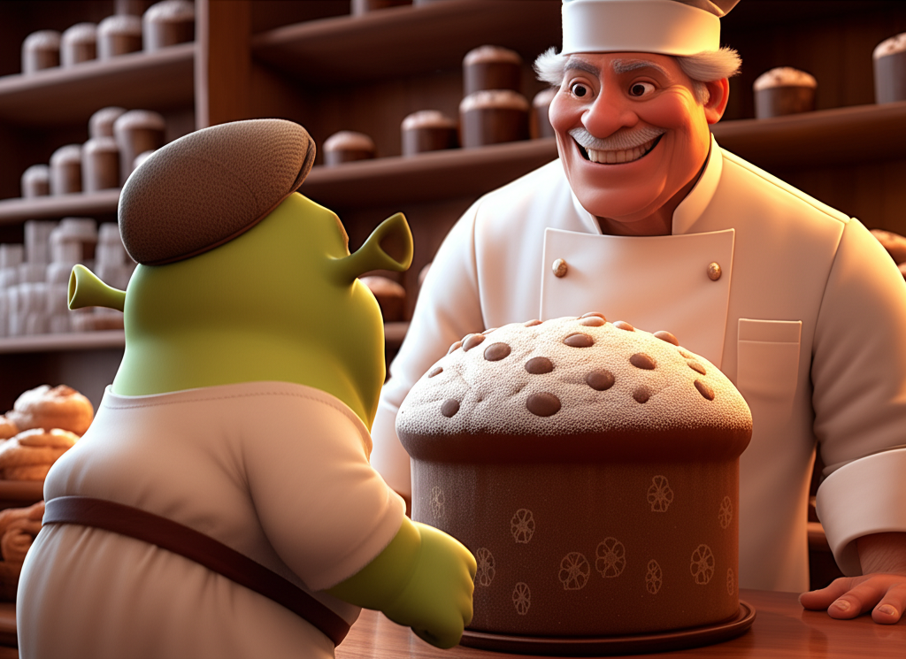
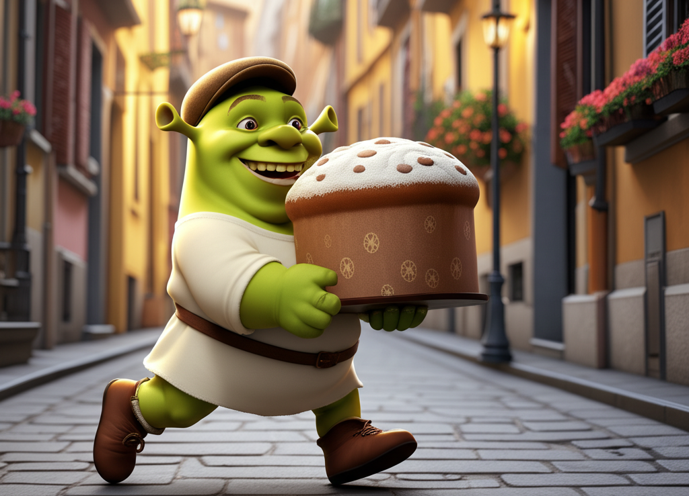

# Text&Image Story Generation Tool - 20250313-1440-shrek-milan

**Prompt:** Generate a story about a cute little Shrek in a 3d digital art style,
walking around Milan and looking for the perfect Panettone.
For each scene, generate an image.

## Chapter 1

Okay, here's a story about a cute little Shrek in Milan, on a quest for the perfect Panettone, with an image prompt for each scene.

## Little Shrek's Milanese Adventure

**Scene 1:**

Little Shrek, no bigger than a well-fed housecat and surprisingly round, stood at the edge of the Piazza del Duomo. His tiny green fists were clenched with determination, and his big, innocent eyes scanned the towering spires. He wore a miniature, slightly too-large newsboy cap.

**Image Prompt:** *A 3D digital art rendering of a very small, cute, and round Shrek character standing at the edge of the Piazza del Duomo in Milan. The Duomo's intricate facade rises impressively in the background, slightly blurred to focus on little Shrek. He's wearing a small, slightly tilted newsboy cap. The lighting is bright and sunny, casting soft shadows.*

**Scene 2:**

His tiny, stubby legs propelled him forward, past elegant shops displaying designer clothes. Little Shrek peered into each window, his gaze not on the silks or leather, but searching… searching for the golden dome of a perfect Panettone. He even had to hop a little to see over some of the displays.

**Image Prompt:** *A 3D digital art rendering showing little Shrek walking past a high-end fashion boutique in Milan. The window display features stylish clothing, but little Shrek's big green eyes are focused intently on something out of frame (presumably down the street). His expression is one of focused searching. The background is slightly blurred to emphasize little Shrek.*

**Scene 3:**

He stumbled upon a bustling outdoor market, filled with the aroma of fresh produce and Italian delicacies. Little Shrek’s nose twitched, picking up a faint, sweet scent. He navigated through the legs of shoppers, a tiny green submarine in a sea of trousers and skirts.

**Image Prompt:** *A 3D digital art rendering of little Shrek in the midst of a busy outdoor market in Milan. Stalls piled high with colorful fruits, vegetables, and cheeses surround him. His head is tilted upwards, nose sniffing the air with a hopeful expression. Shoppers' legs are visible around him, slightly out of focus to emphasize his small size.*

**Scene 4:**

Finally, he found it! A charming pasticceria with shelves stacked high with Panettone of all sizes. Little Shrek stood on his tiptoes, gazing at the golden, raisin-studded loaves. One particular Panettone, perfectly domed and dusted with powdered sugar, seemed to glow.

**Image Prompt:** *A 3D digital art rendering of little Shrek standing outside a traditional Milanese pasticceria. The window display is filled with various Panettone cakes, some wrapped in colorful paper. Little Shrek's eyes are wide with wonder and excitement as he looks at a particularly beautiful Panettone in the window.*

**Scene 5:**

Inside the pasticceria, the aroma of sweet dough and candied fruit was intoxicating. A kind-faced baker, with flour dusting his apron, chuckled as he saw the tiny green customer. Little Shrek pointed a determined finger at the prized Panettone on the top shelf.

**Image Prompt:** *A 3D digital art rendering of the interior of the pasticceria. A friendly baker with a flour-dusted apron is looking down with amusement at little Shrek, who is pointing upwards towards a large, beautifully shaped Panettone on a high shelf. Other pastries and cakes are visible in the background.*

**Scene 6:**

Mission accomplished! Little Shrek, barely able to carry the surprisingly heavy Panettone (which was still quite large compared to him), waddled happily down a picturesque Milanese street lined with colorful buildings. A small bite had already been taken, leaving a dusting of powdered sugar on his tiny green cheek.

**Image Prompt:** *A 3D digital art rendering of little Shrek waddling down a charming Milanese street with colorful buildings and flower boxes. He is carrying a large Panettone, slightly tilted, in his arms. A small bite mark is visible on the Panettone, and there's a dusting of powdered sugar on his cheek. His expression is one of pure joy.*

