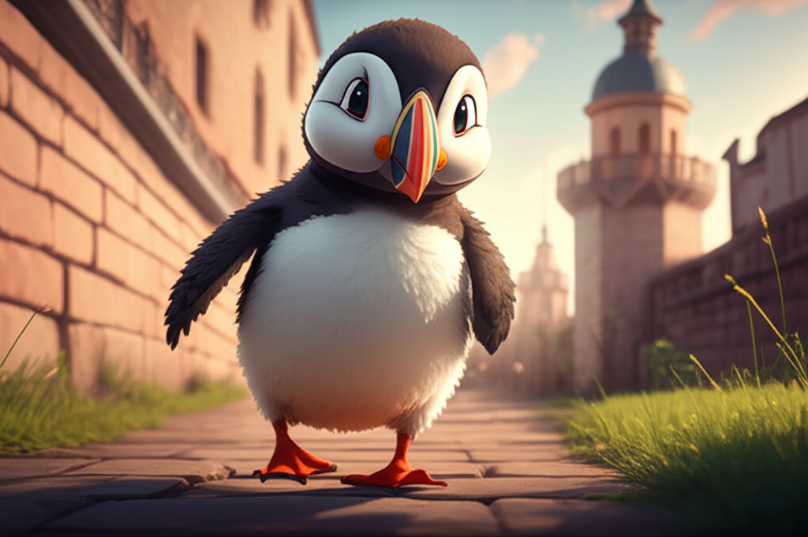
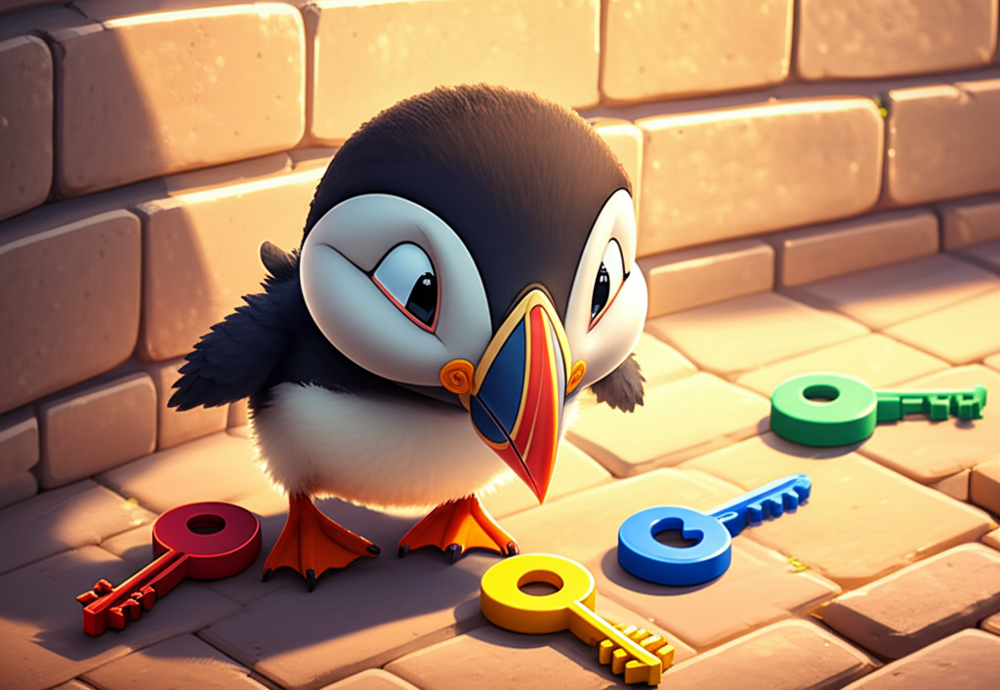
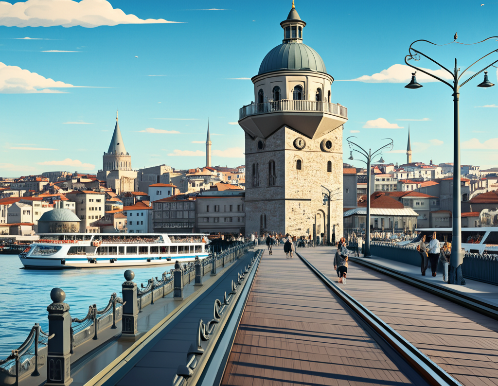
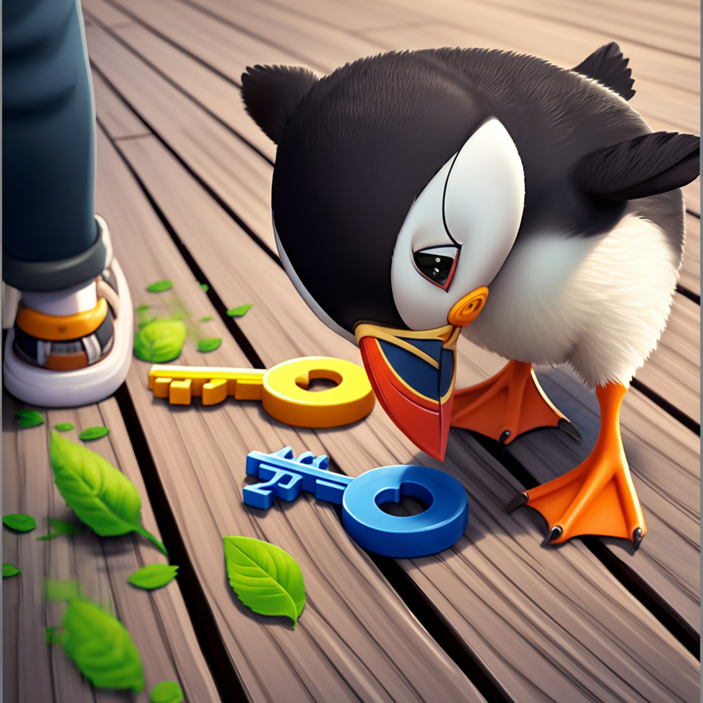
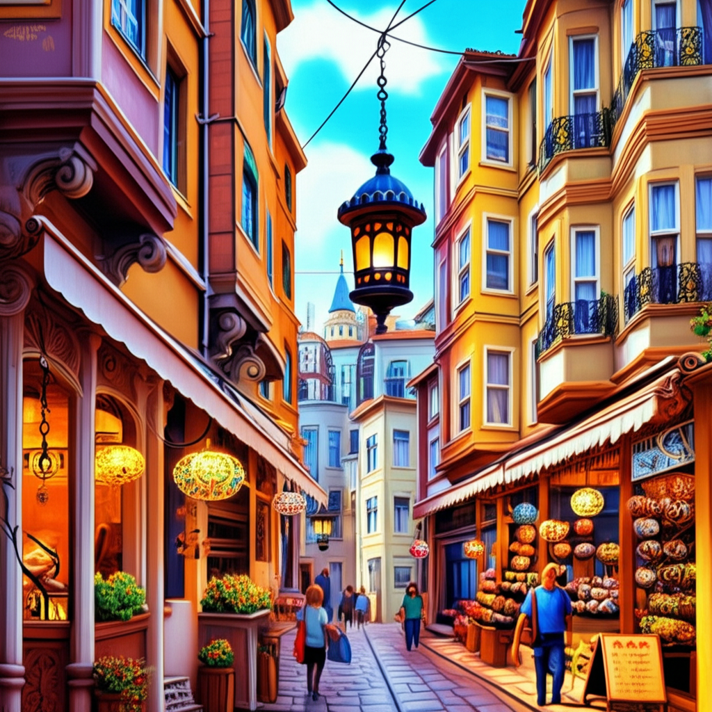
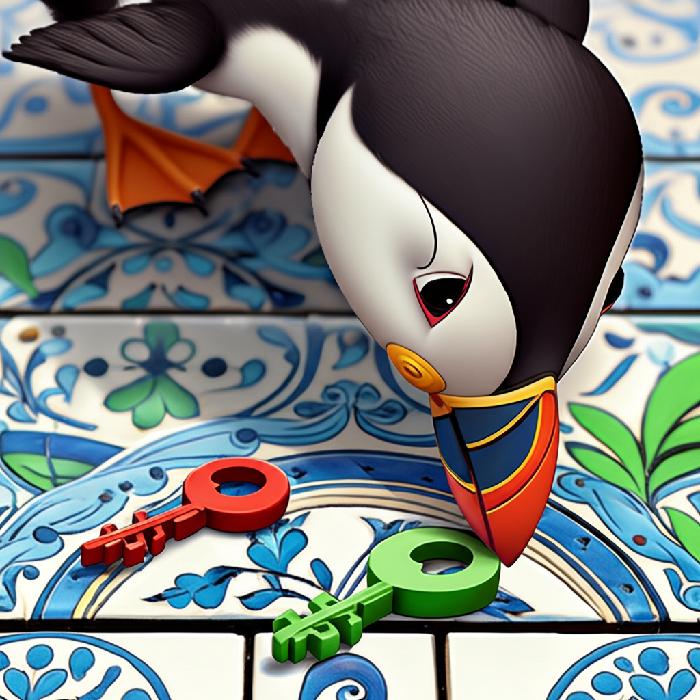

# Text&Image Story Generation Tool - 20250313-1458-puffin-istanbul

**Prompt:** Generate a story about a cute baby puffin in a 3d digital art style.
The puffin is walking around the landmark of Istanbul and passes the Galata bridge.
Every now and there, the puffin finds 4 colorful keys, one for every google logo (red, yellow, green, blue)

For each scene, generate an image.

## Chapter 1

## Pip the Puffin's Istanbul Adventure

**Scene 1:**

A fluffy, grey down-covered baby puffin with oversized, endearing black eyes and bright orange feet waddles clumsily onto the cobblestones near a grand, ancient stone wall – a recognizable section of the Theodosian Walls of Istanbul. The morning light casts long shadows, highlighting the texture of the weathered stones. Pip, our little puffin, looks around with innocent curiosity.

**Scene 2:**

Pip continues his wobbly journey and spots something bright nestled between the ancient stones. He tilts his head, his large eyes focusing. Lying there are four small, vibrant keys: one a cheerful red, another a sunny yellow, a third a leafy green, and finally a sky blue. Pip pecks curiously at the red key.

**Scene 3:**

Now, Pip is making his way towards the iconic Galata Bridge. The towering Galata Tower looms in the background, its conical roof sharp against the bright sky. Ferries glide across the sparkling blue waters of the Bosphorus below. Pip toddles along the pedestrian walkway, his little orange feet making soft taps on the wooden planks.

**Scene 4:**

Midway across the bustling Galata Bridge, amidst the feet of the passing people, Pip spots another set of colorful keys. This time, they lie near a discarded simit (a Turkish bagel). The red key gleams in the sunlight, the yellow one rests against the sesame seeds, the green one blends slightly with a fallen leaf, and the blue one shines against the grey wood. Pip nudges the yellow key with his beak.

**Scene 5:**

Having crossed the Galata Bridge, Pip finds himself in a vibrant area with colorful buildings and the sounds of street vendors. He waddles past stalls selling Turkish delights and carpets. In the foreground, a traditional Turkish lantern hangs, casting a warm glow.

**Scene 6:**

Near a stack of intricately patterned ceramic tiles, Pip discovers his third set of four keys. The red key lies on a white tile, the yellow one against a blue pattern, the green one near a floral design, and the blue one on a terracotta tile. Pip tries to peck at the green key, his fluffy head bobbing.

**Scene 7:**

Pip continues his exploration, now with the Hagia Sophia's magnificent domes and minarets visible in the distance. The air feels warmer, and the sounds of the city are a gentle hum. Pip looks a little tired but remains curious.

