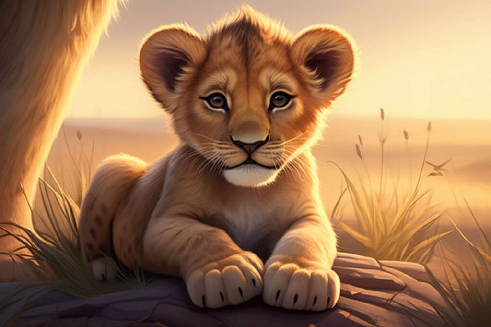
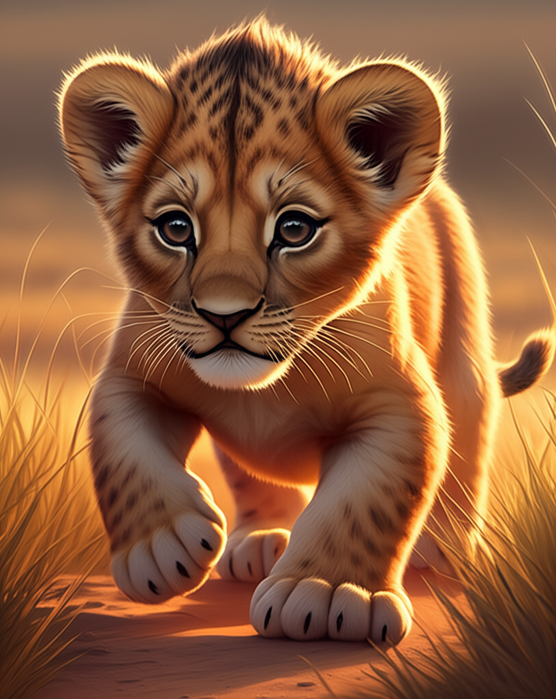
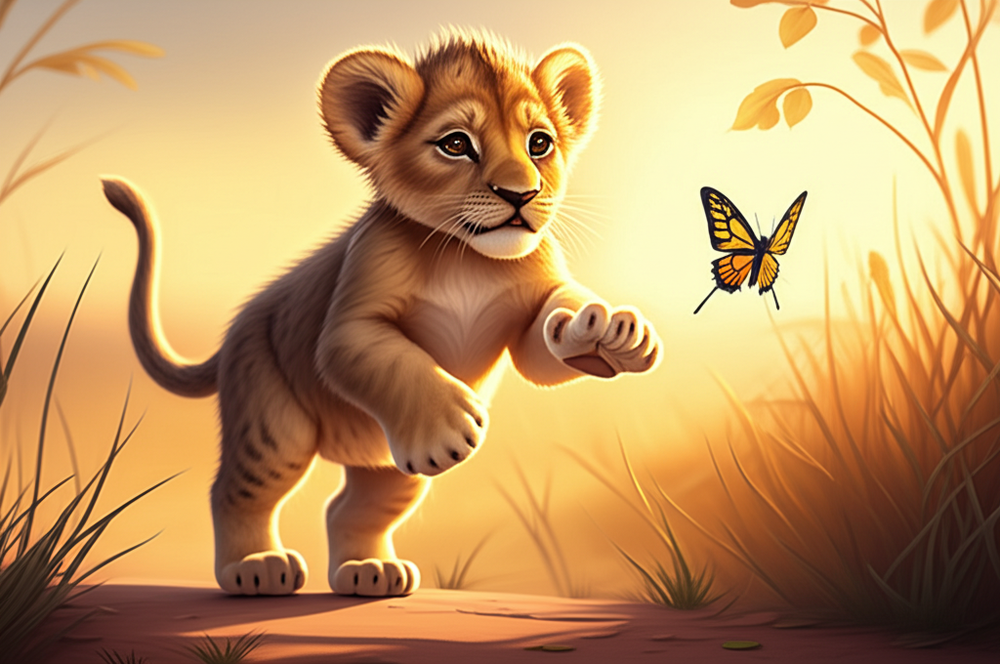
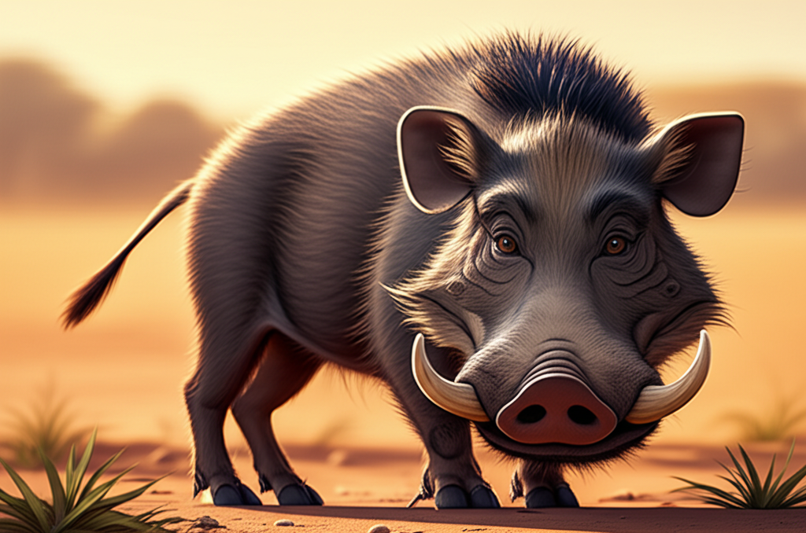
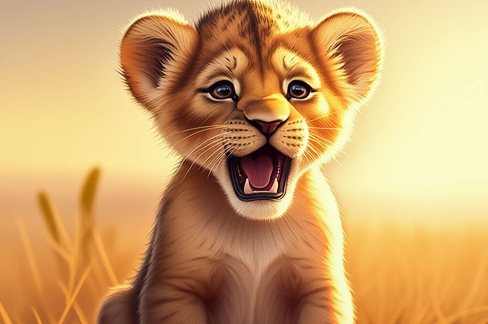
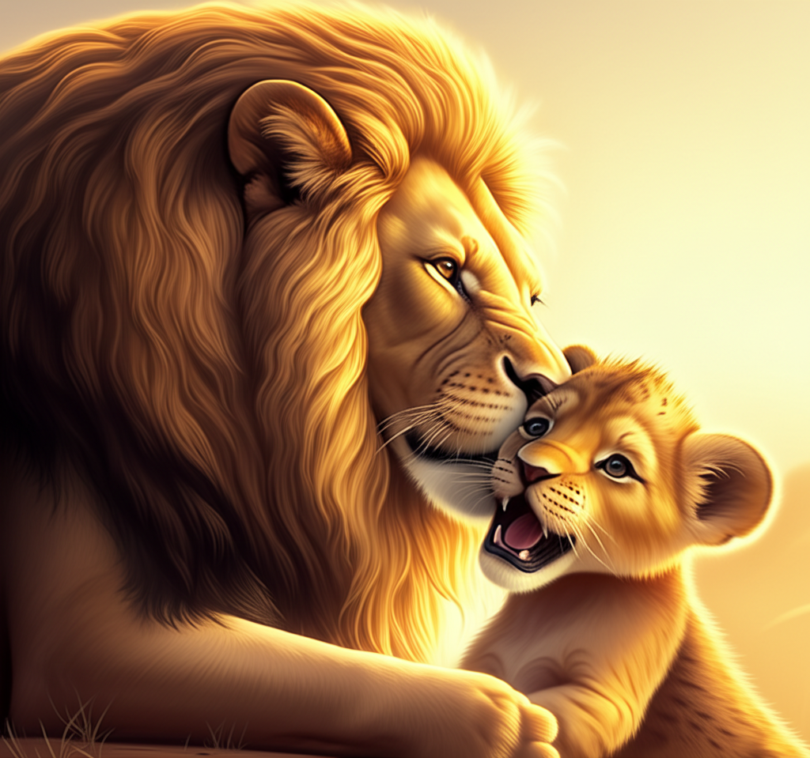

# Text&Image Story Generation Tool - 20250313-1509-kaan

**Prompt:** Generate a story about a cute baby lion called Kaan in a 3d digital art style.
For each scene, generate an image.

## Chapter 1

## Kaan's First Rumble

**Scene 1:**

The sun dripped golden honey across the vast African savanna. A small, fluffy ball of sunshine lay nestled between his mother's massive paws. This was Kaan, a lion cub no bigger than a house cat, his fur the color of warm sand. His tiny pink nose twitched as he dreamt of chasing butterflies. His mother, Sarabi, watched over him with eyes full of fierce love, her golden mane a regal halo around her gentle face.

**Scene 2:**

Kaan awoke with a tiny yawn, his miniature teeth peeking out. He wobbled to his feet, his legs still a bit unsure. He looked up at his mother, his big, innocent brown eyes full of curiosity. Sarabi nudged him playfully with her head, a soft rumble vibrating in her chest.

**Scene 3:**

Drawn by a fluttering of colorful wings, Kaan took his first tentative steps away from his mother. A bright yellow butterfly danced just out of reach, its delicate patterns mesmerizing him. He pounced, his tiny paws swatting at the air, but the butterfly simply flitted away, as light as a sunbeam.

**Scene 4:**

A strange sound reached Kaan's ears – a low, guttural growl. He froze, his playful curiosity replaced with a flicker of fear. He turned to see a grumpy-looking warthog digging in the dirt nearby, oblivious to the tiny lion cub.

**Scene 5:**

Remembering the rumbles he felt when his mother purred, Kaan tried to imitate the sound. He puffed out his tiny chest and let out a shaky, high-pitched squeak that was more like a kitten's meow than a lion's roar.

**Scene 6:**

Sarabi, who had been watching Kaan's explorations, chuckled softly, a deep rumbling sound that vibrated through the ground. She approached him gently, nuzzling him with her large head. Kaan leaned into her, feeling safe and loved.

**Scene 7:**

Sarabi then showed Kaan how to truly rumble. She took a deep breath and let out a low, powerful growl that echoed across the savanna. Kaan watched, mesmerized, feeling the vibrations in his own small body.

