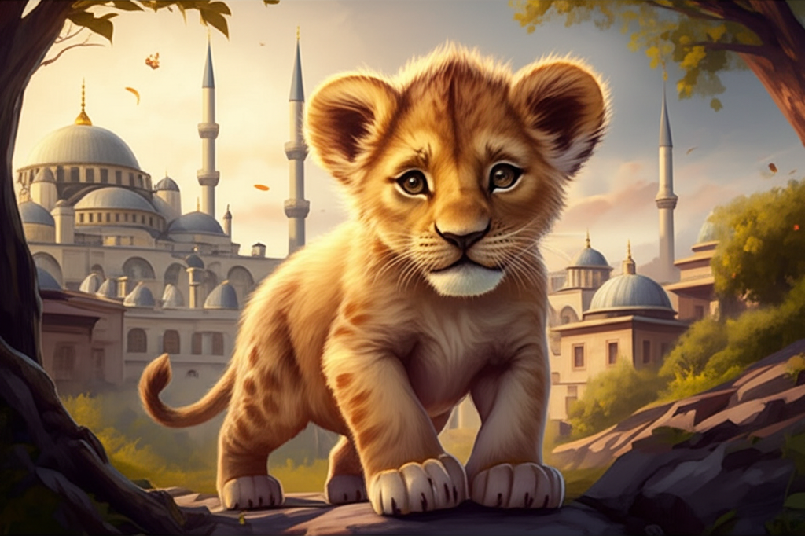
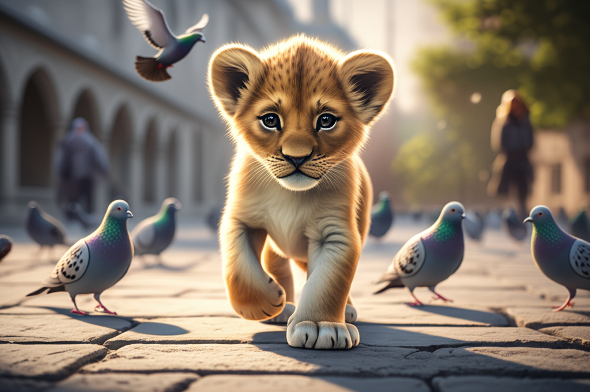
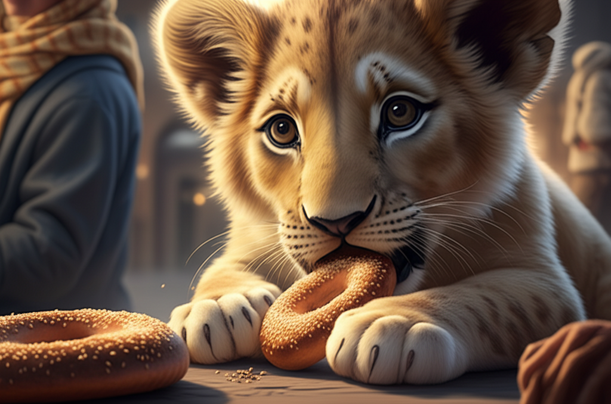
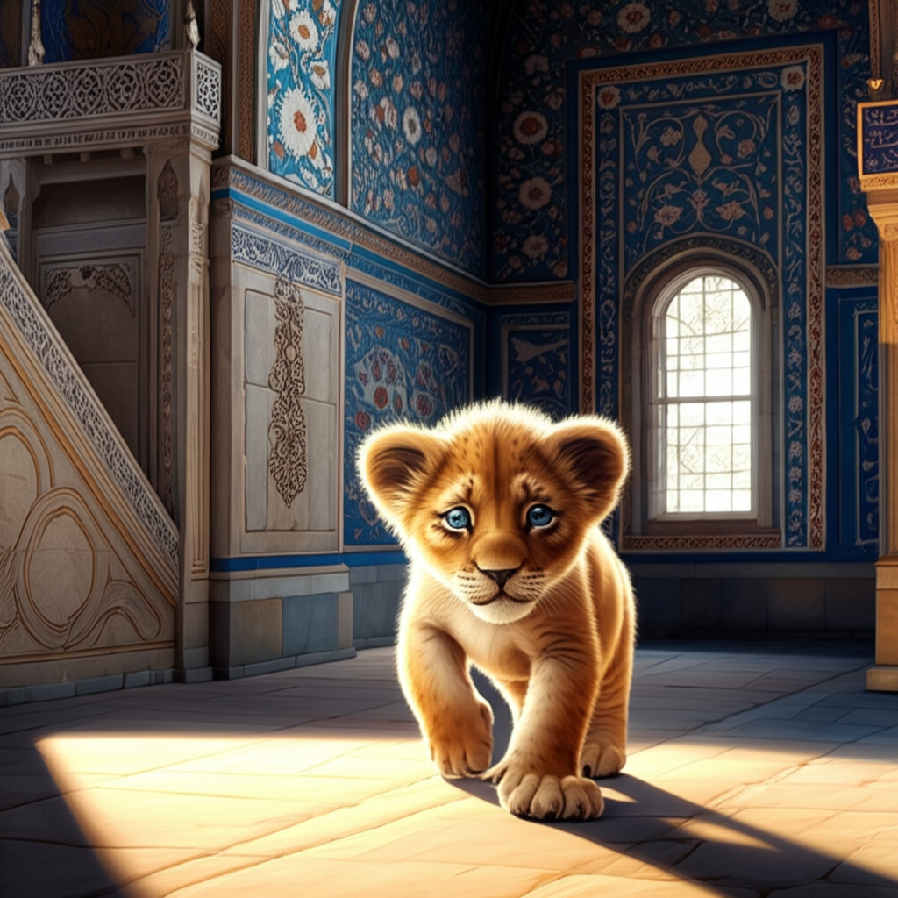

# Text&Image Story Generation Tool - 20250313-1513-kaan

**Prompt:** Generate a story about a cute baby lion called Kaan in a 3d digital art style.
All the story is set is in Istanbul and particularly around Sultanammet Mosque.
For each scene, generate an image.

## Chapter 1

Kaan, a fluffy ball of tawny fur with paws too big for his tiny body, blinked his wide, innocent blue eyes at the towering domes and slender minarets of the Sultanahmet Mosque. The early morning sun cast a golden glow on the ancient stones, making the intricate blue tiles shimmer like a thousand tiny sapphires. Kaan, having somehow found himself separated from his pride (a story for another time), was utterly mesmerized by the grand structure. He let out a soft, curious mew, a sound that barely registered against the morning call to prayer echoing across the Istanbul skyline.

His tiny tummy rumbled, reminding him of his missing mother. With a determined wiggle of his tail, Kaan decided to explore. He padded cautiously across the vast courtyard, his soft paws barely making a sound on the cool stone. Pigeons, startled by his unexpected presence, took flight in a flurry of grey wings. Kaan watched them with wide-eyed wonder, his head tilting from side to side. He even tried to pounce on a particularly bold pigeon that landed nearby, but his clumsy attempt only resulted in him tumbling head over heels.

Feeling a bit peckish, Kaan followed his nose, which led him to a group of tourists enjoying simit, the iconic Turkish sesame bagels. The aroma was enticing! He sat patiently a little distance away, his big blue eyes pleading. A kind elderly woman noticed him. Her eyes widened in surprise, but then softened with amusement. She broke off a small piece of her simit and gently tossed it towards him. Kaan sniffed it cautiously before gobbling it down with gusto. The sesame seeds tickled his nose, making him sneeze adorably.

After his snack, Kaan wandered into the cool shade of the mosque's arches. The intricate patterns of the Iznik tiles, with their vibrant blues, reds, and greens, seemed to dance before his eyes. He spotted a stray sunbeam illuminating a particularly beautiful floral motif and batted playfully at it with his paw, as if trying to catch a golden butterfly. The vastness of the space made him feel small, but also strangely safe.

Tired from his morning adventure, Kaan found a quiet corner near a large, ornate fountain in the outer courtyard. The gentle splashing of the water was soothing, and the scent of blooming roses from a nearby garden filled the air. He curled up in a tight ball, his soft fur blending with the warm tones of the stone. As he drifted off to sleep, dreaming of chasing pigeons and the delicious taste of simit, a familiar, worried roar echoed in the distance. Could it be his mother?

