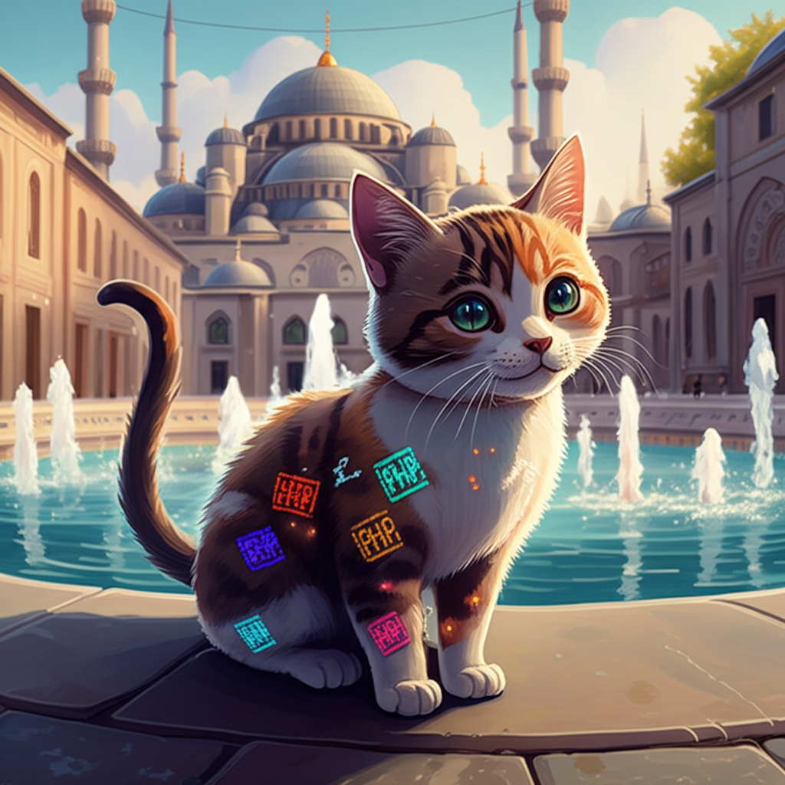
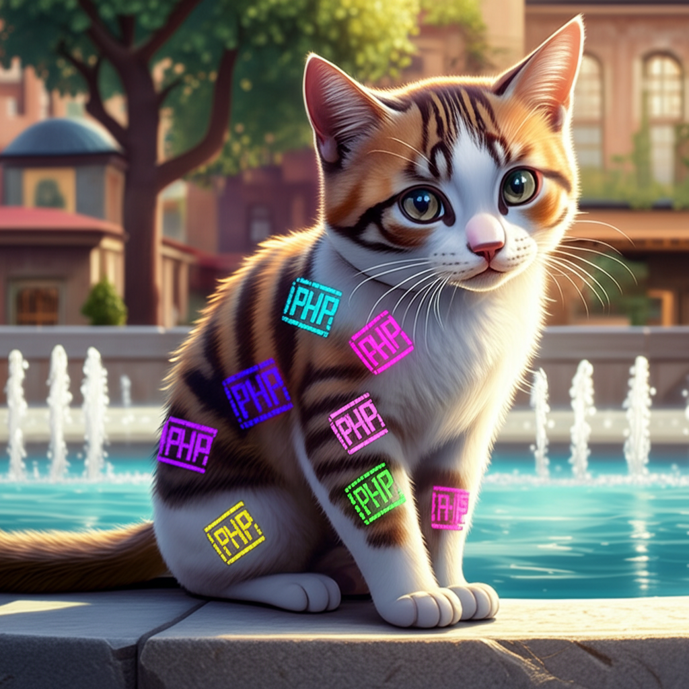
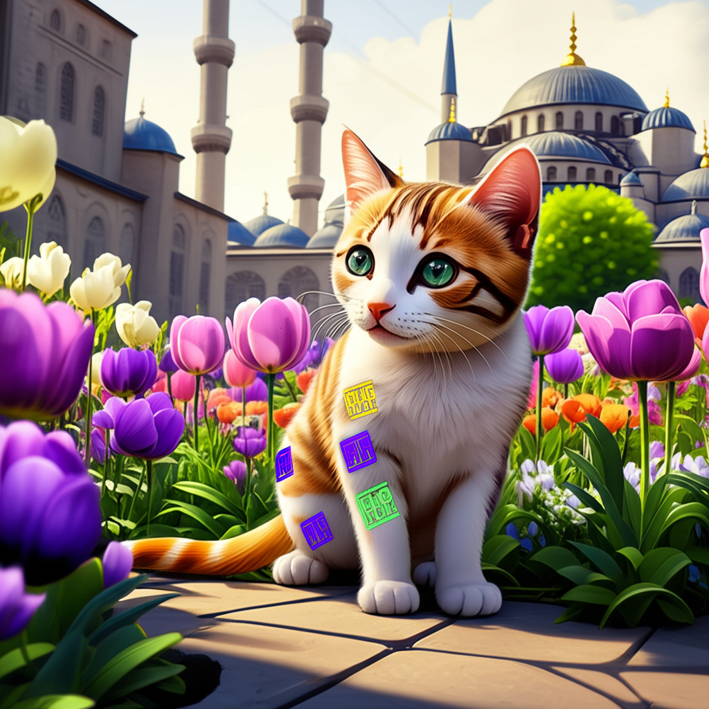
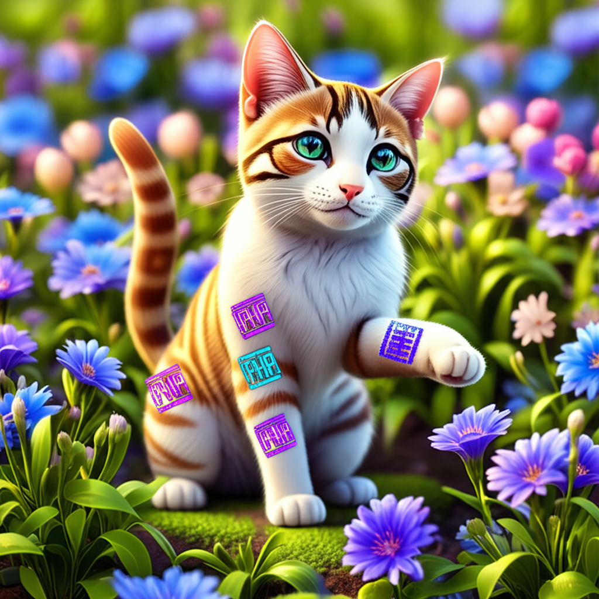
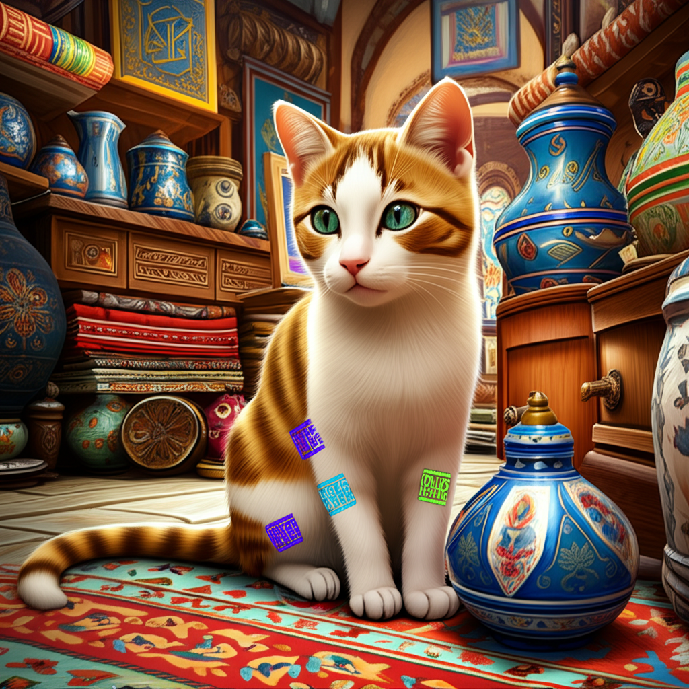
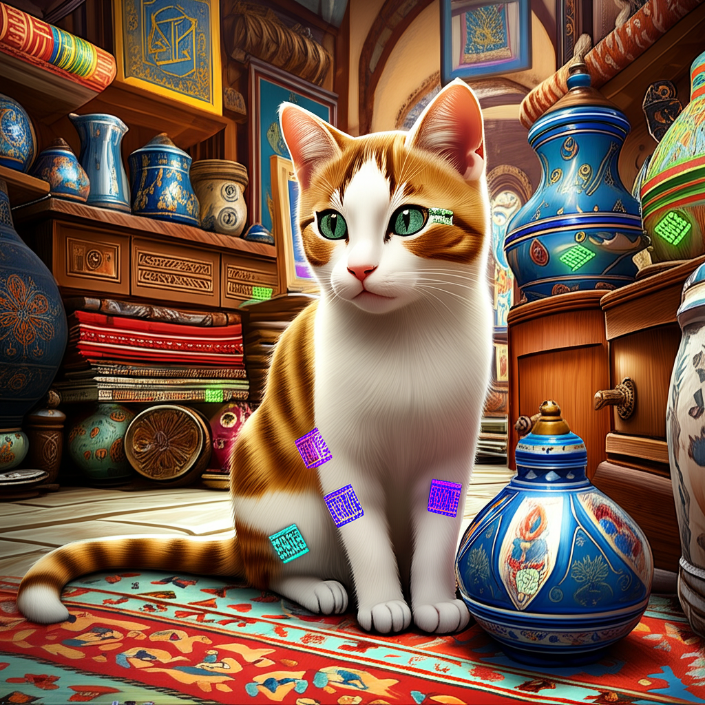

# Text&Image Story Generation Tool - 20250313-1556-cat-istanbul

**Prompt:** Generate an illustrated story about a cute cat in a 3d digital art style. All the story is set is in Istanbul around Sultanammet Mosque. In each scene, the cat is finding colorful "PHP" code snippets. For each scene, generate an image.

## Chapter 1

## The Curious Code Cat of Sultanahmet

**Our hero:** A fluffy, ginger and white cat with big, curious green eyes and perpetually wiggling whiskers. Let's call him "Pixel".

**The Setting:** The vibrant and historic Sultanahmet Square in Istanbul, with the majestic Blue Mosque (Sultanamet Mosque) as a constant, breathtaking backdrop.

**The Quest:** Pixel, in his daily wanderings, starts discovering strange, colorful squares of light emanating from unexpected places. These squares, as he'll soon realize, are snippets of "PHP" code, somehow materialized into the real world.

---

**Scene 1:**

**Story:** Pixel was enjoying a morning stretch on a sun-warmed cobblestone near the fountain in Sultanahmet Square. Pigeons fluttered nearby, but something else caught his eye. A faint, glowing rectangle was nestled amongst the fallen leaves, its surface shimmering with vibrant text.

---

**Scene 2:**

**Story:** Curiosity piqued, Pixel cautiously approached the glowing rectangle. He sniffed it, then tentatively pawed at it. The light felt warm and slightly tingly. The code read: `<?php echo "Merhaba Dunya!"; ?>`. He tilted his head, wondering what these strange symbols meant.

---

**Scene 3:**

**Story:** Later that day, Pixel was exploring the flowerbeds near the grand entrance of the Blue Mosque. Amongst the colorful tulips, another glowing square caught his eye. This one was perched precariously on a large, purple bloom.

---

**Scene 4:**

**Story:** Pixel carefully climbed onto the large tulip to investigate. The code on this snippet read: `$color = "mavi";`. He rubbed his head against the glowing letters, enjoying the faint warmth. "Mavi," he thought, remembering the beautiful blue tiles of the mosque.

---

**Scene 5:**

**Story:** Seeking shade from the afternoon sun, Pixel strolled through the Arasta Bazaar, just behind the Blue Mosque. Amongst the colorful carpets and souvenirs, he spotted another glowing rectangle tucked beside a stack of intricately patterned ceramic bowls.

---

**Scene 6:**

**Story:** This time, the code read: `for ($i = 0; $i < 5; $i++) { echo "*"; }`. Pixel watched, fascinated as five tiny, glowing asterisks briefly flashed on the snippet before fading away. It was like magic!

---

**Scene 7:**

**Story:** As evening approached, the call to prayer echoed from the minarets. Pixel found himself near the ancient walls surrounding the mosque. There, nestled in a crack in the weathered stone, was another glowing piece of code.

