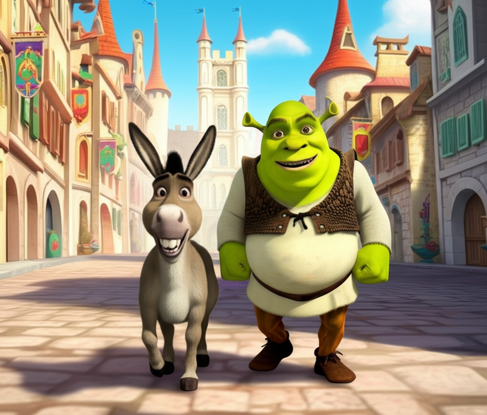
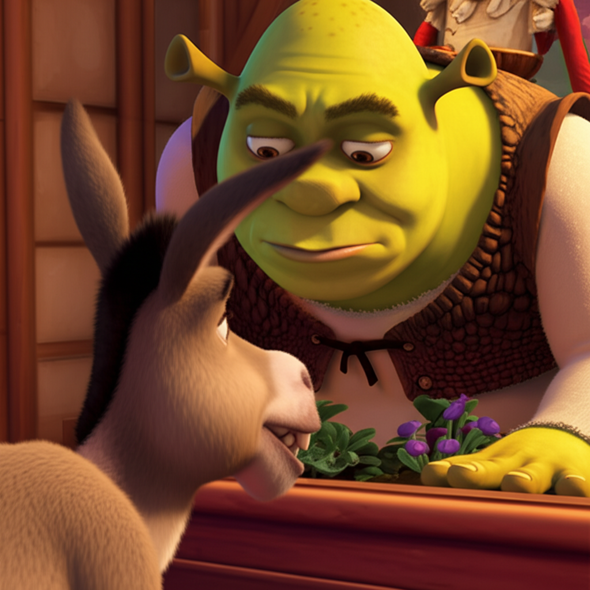
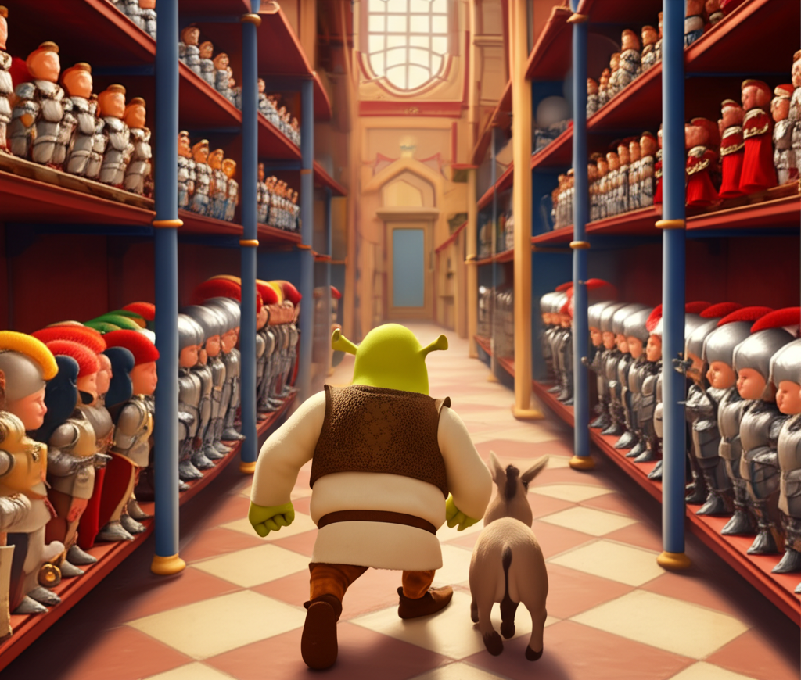
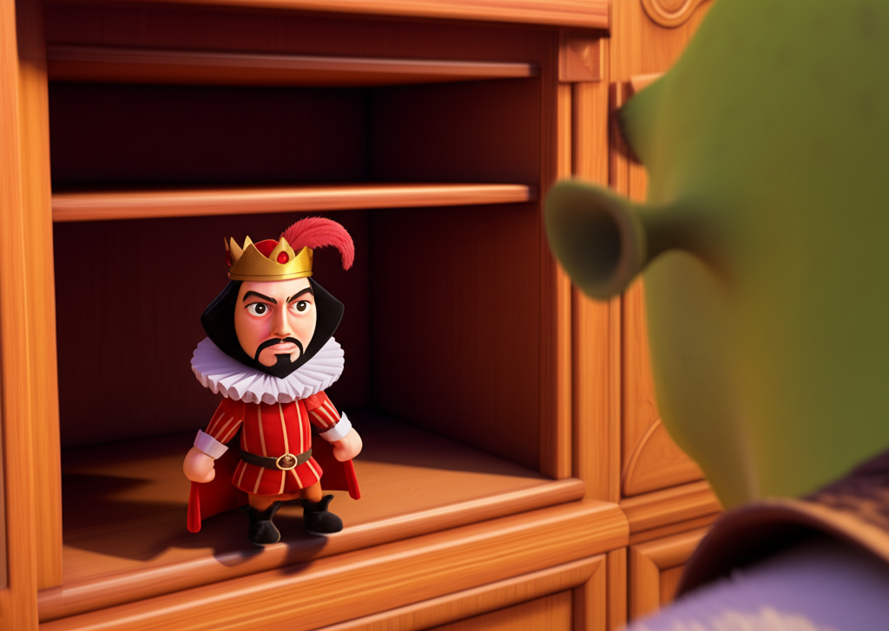
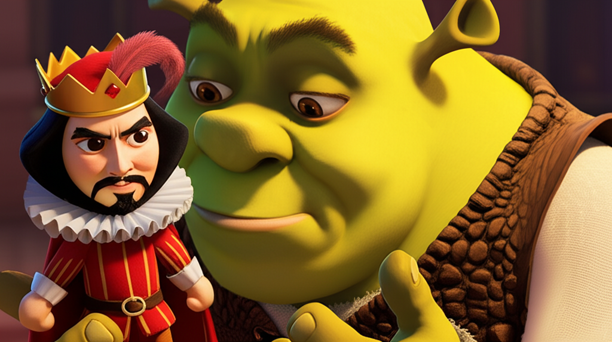
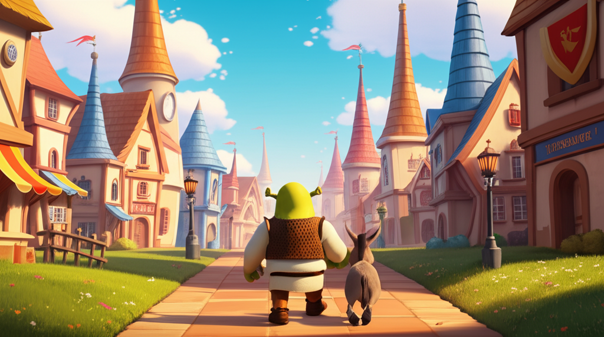

# Text&Image Story Generation Tool - 20250314-0825-shrek-duloc

**Prompt:** Generate a story about a cute little Shrek in a 3d digital art style, walking around Duloc with donkey and looking for the perfect present for Fiona. Finally he finds a great present: a lord Farquad pelouche. For each scene, generate an image. 

## Chapter 1

## The Littlest Ogre's Quest

**Scene 1:**

A wide shot of Duloc's geometrically perfect streets. Tiny, adorable Shrek, no bigger than a house cat with large, innocent green eyes, waddles down the cobblestone path. His tiny brown vest looks a bit too big on him. Donkey, shrunk down to a miniature pony, trots excitedly beside him, his miniature teeth slightly bucked. The sun shines brightly on the overly manicured flowerbeds.

**Scene 2:**

A close-up on little Shrek's face. He scrunches his brow in adorable concentration as he peers into the window of a ridiculously pristine toy shop. Donkey cranes his neck to see over Shrek's head, his eyes wide with curiosity. The window display features various overly cheerful and somewhat unsettling Duloc-themed toys.

**Scene 3:**

Inside the toy shop. Little Shrek waddles down an aisle filled with perfectly organized shelves of identical-looking princess dolls and miniature knight figurines. He looks slightly overwhelmed. Donkey sniffs at a shelf of tiny wooden swords, his nose twitching.

**Scene 4:**

Little Shrek stops abruptly in front of a slightly dusty corner at the back of the shop. His eyes widen with delight. There, sitting on a forgotten shelf, is a plush toy of Lord Farquaad. It's surprisingly detailed, with his signature smug expression and overly large crown.

**Scene 5:**

A close-up of little Shrek carefully holding the Lord Farquaad plush. He beams, his tiny ogre teeth showing in a happy grin. Donkey peeks over his shoulder, looking slightly confused but happy for his little friend.

**Scene 6:**

Little Shrek and Donkey walking happily back out of Duloc, the Lord Farquaad plush held proudly in Shrek's arms. The perfect rows of Duloc buildings fade into the background as the little ogre and his miniature companion head back towards their swamp, a very special and slightly ironic gift in tow.

