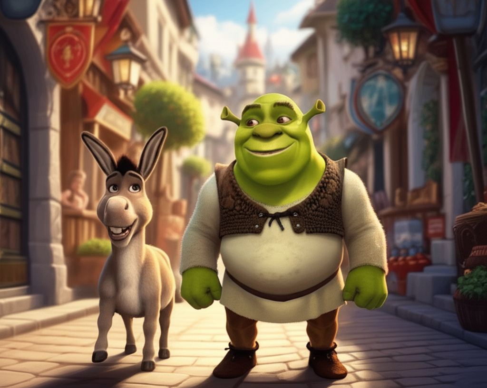
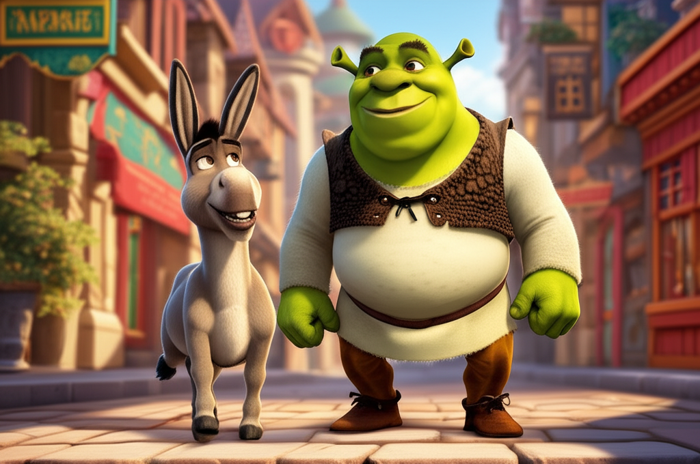
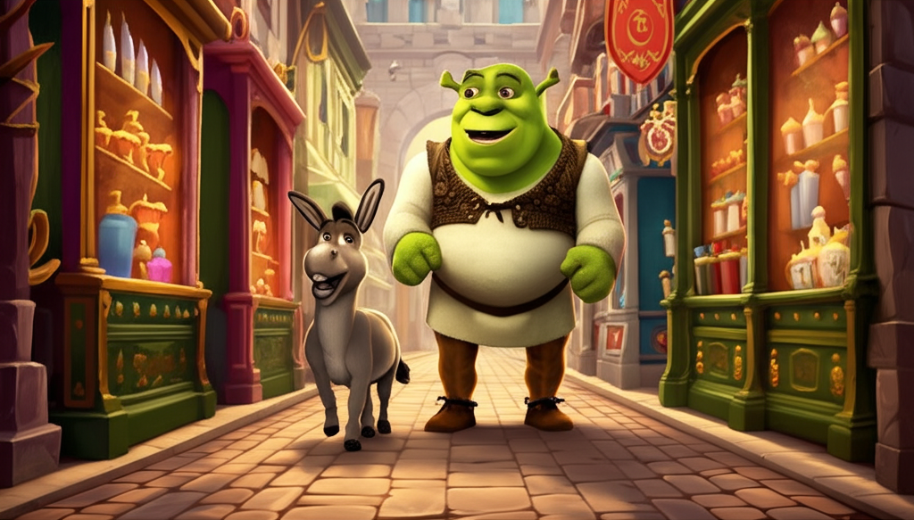
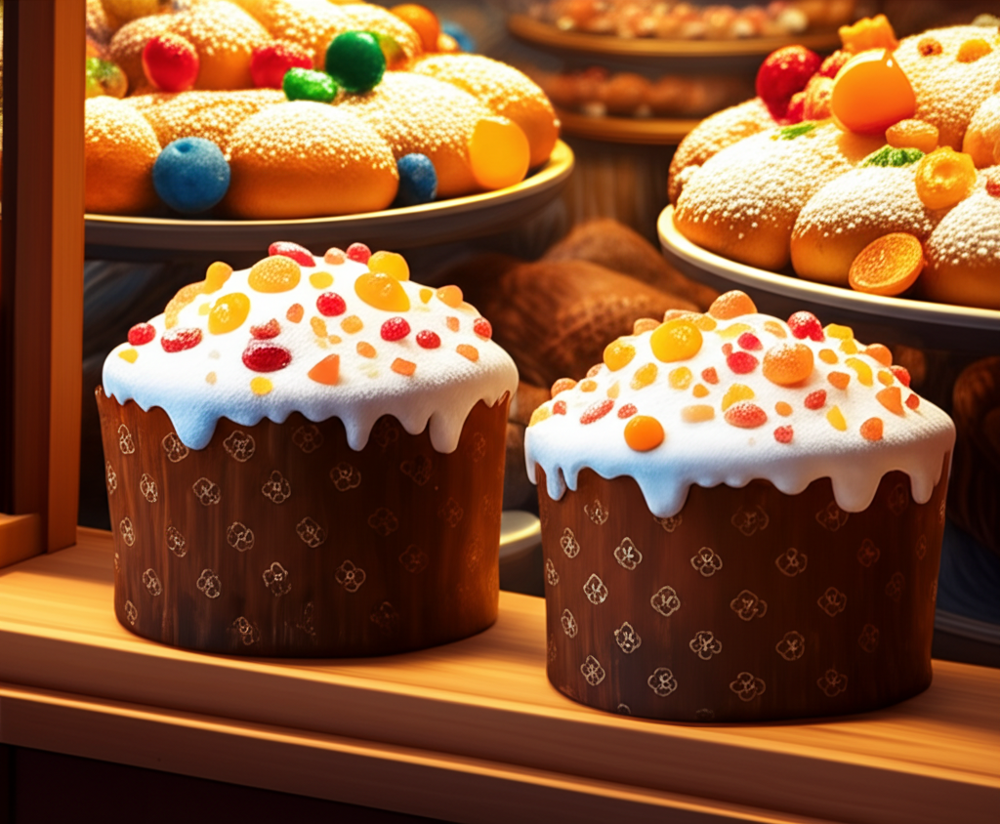
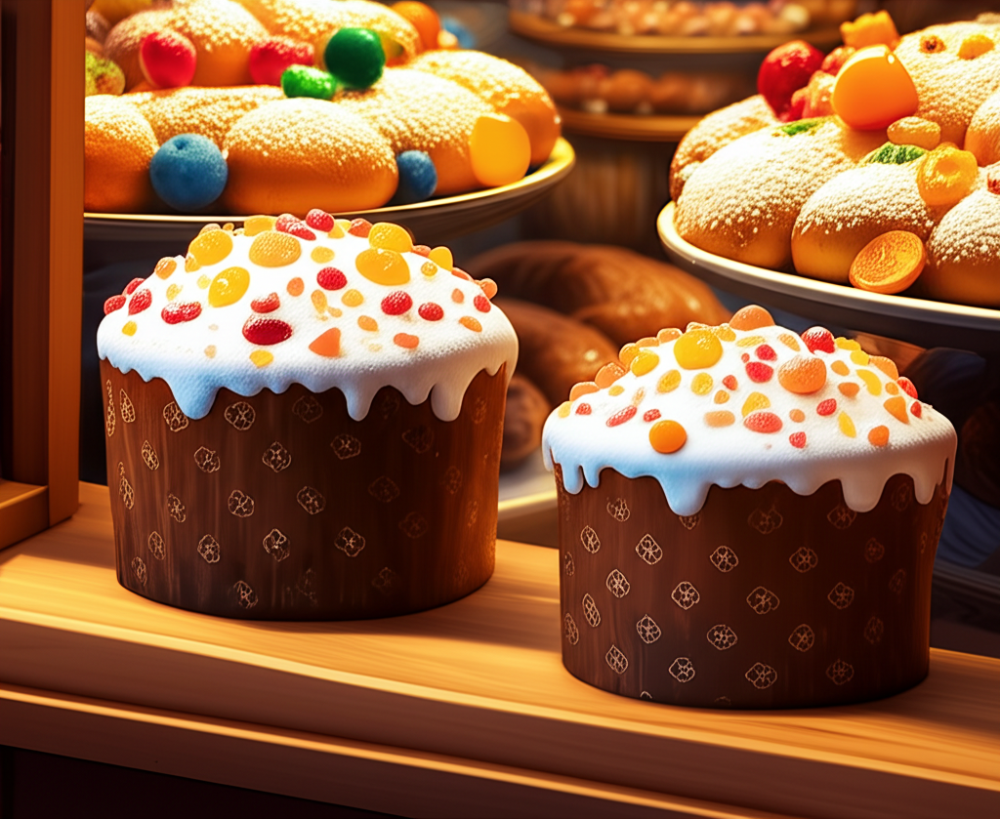
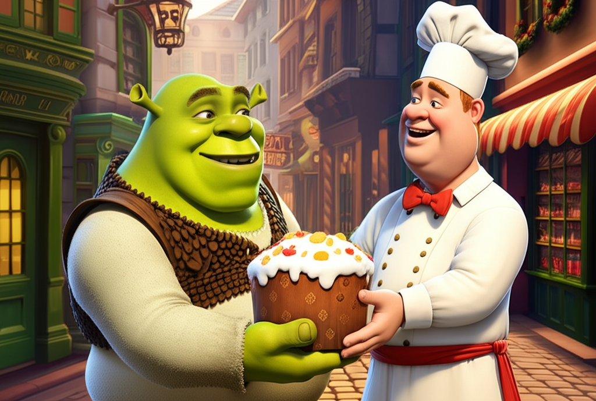

# Text&Image Story Generation Tool - 20250314-0826-shrek-duloc

**Prompt:** Generate an illustrated story about a cute little Shrek in a 3d digital art style, walking around Duloc with donkey and looking for the perfect present for Fiona. Finally he finds a great present: a panettone. For each scene, generate an image. 

## Chapter 1

## Little Shrek's Big Present

**Scene 1:** Our story begins in the brightly colored, slightly too-perfect land of Duloc. Little Shrek, round and green with adorable stubby horns, waddled down a cobblestone street. Donkey, a miniature version of his chatty self, trotted excitedly beside him.

**Scene 2:** "So, Shrek," Donkey chirped, his ears flopping with each step. "What kind of super-duper present are we looking for Fiona? Something shiny? Something sparkly?" Little Shrek pondered, his brow furrowed in thought as they passed a shop window displaying glittering trinkets.

**Scene 3:** They continued their search, peeking into various shops. One sold delicate perfumes, another fancy hats. Little Shrek shook his head at each. "Nah, Donkey," he mumbled, "Fiona deserves something... special. Something yummy!"

**Scene 4:** Suddenly, a delicious aroma wafted from a nearby bakery. Little Shrek's nose twitched. He followed the scent, Donkey trotting close behind, until they reached a window filled with golden-brown, dome-shaped cakes dusted with powdered sugar and candied fruits.

**Scene 5:** "Ooh, what are those?" Donkey asked, craning his neck. "They look amazing!" Little Shrek's eyes widened. "It's a panettone, Donkey! I heard Fiona mention she loves them! It's perfect!" He imagined Fiona's happy smile as she tasted the sweet bread.

**Scene 6:** Little Shrek eagerly entered the bakery and pointed at the largest panettone on display. The baker, a plump man with a flour-dusted apron, smiled warmly. Soon, Little Shrek was carefully carrying the beautifully wrapped panettone, his heart full of excitement.

**Scene 7:** Walking hand-in-hoof with Donkey, Little Shrek beamed. He knew Fiona would adore this sweet and special treat. His quest for the perfect present was finally over, and he couldn't wait to see Fiona's face light up when he gave it to her.

