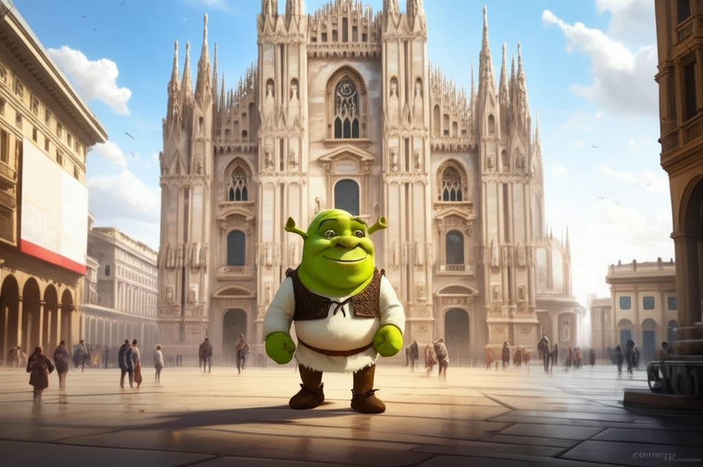
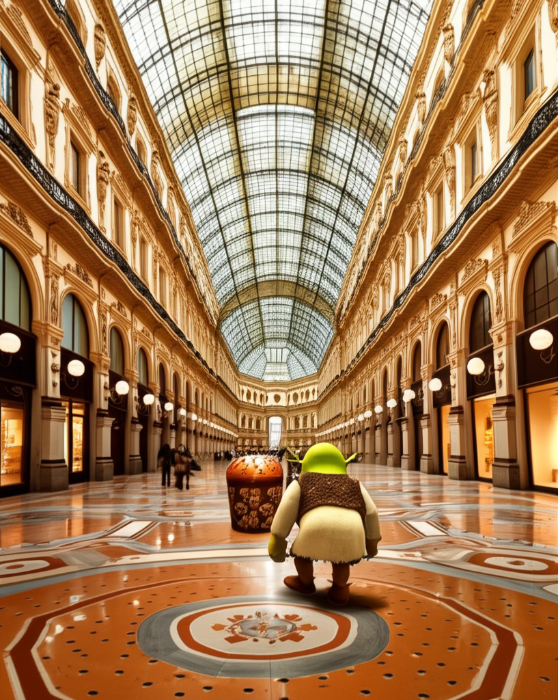
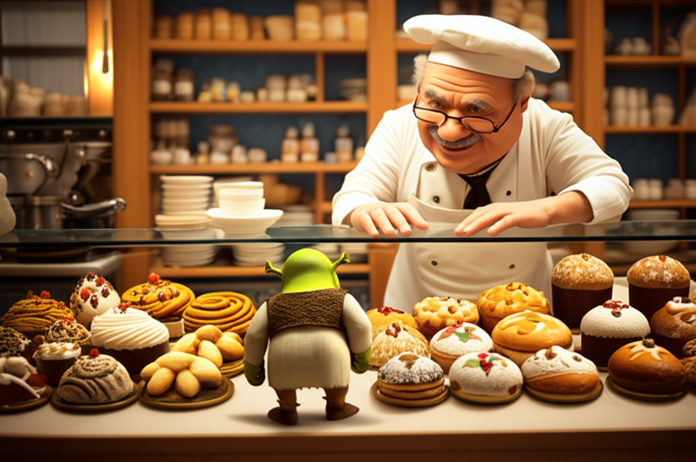
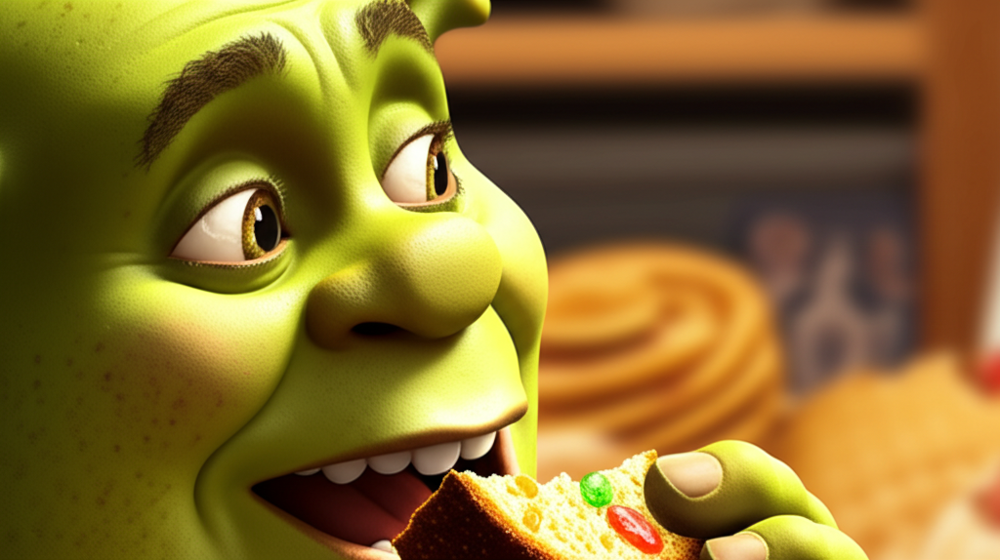
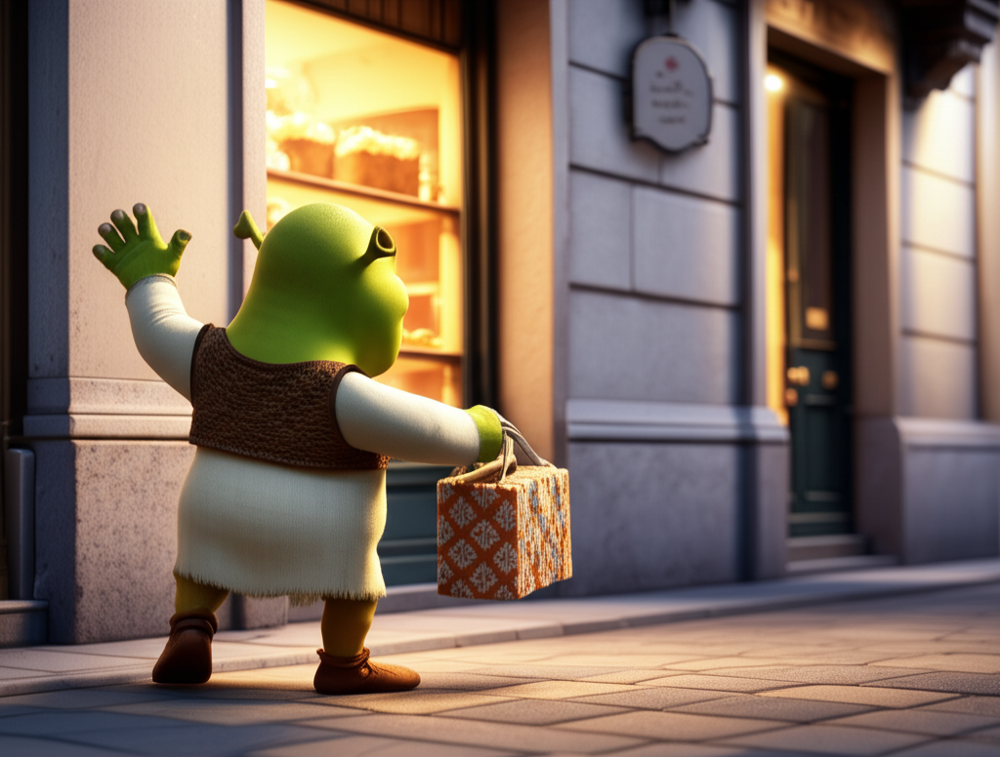
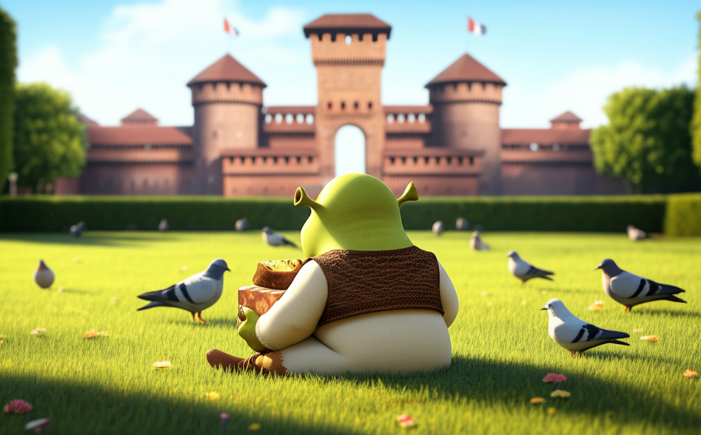

# Text&Image Story Generation Tool - 20250316-0753-shrek-milan

**Prompt:** Generate a story about a cute little Shrek in a 3d digital art style, walking around Milan and looking for the perfect Panettone. For each scene, generate an image. 

## Chapter 1

## Shrek's Milanese Mission: The Quest for the Perfect Panettone

**Scene 1:**

Our story begins with a sight rarely seen: a miniature, undeniably cute Shrek, about the size of a well-fed guinea pig, standing bewildered yet determined in the heart of Milan. His tiny green hands clutched a crumpled tourist map that was almost bigger than he was. The Duomo di Milano loomed majestically in the background, its spires piercing the clear Italian sky. Sunlight glinted off his surprisingly large, innocent eyes.

**Image:** A 3D digital art rendering of a tiny, cute Shrek (think big, round eyes, slightly softer features, maybe a hint of fuzz) standing on the cobblestones of Piazza del Duomo. He's holding an oversized, crumpled tourist map. The Duomo is clearly visible in the background, rendered in high detail with realistic lighting.

**Scene 2:**

Little Shrek, with surprising agility, navigated the bustling Galleria Vittorio Emanuele II. His tiny boots clicked softly on the mosaic floor as he peered into the windows of elegant boutiques. He wasn't interested in the designer clothes or leather goods, though. His gaze was fixed on the tantalizing displays of Panettone – tall, golden domes adorned with candied fruit and powdered sugar. He let out a tiny, hopeful sigh.

**Image:** A 3D digital art rendering of the tiny Shrek walking through the Galleria Vittorio Emanuele II. The ornate architecture and glass ceiling are visible above. He's looking intently at a shop window filled with beautifully wrapped Panettone boxes of various sizes. Perhaps a reflection of the Panettone is visible in his large eyes.

**Scene 3:**

Our little green gourmand found himself in a traditional pasticceria. The air was thick with the sweet aroma of baked goods. He stood on his tippy-toes, trying to see over the glass counter, his nose twitching with anticipation. A kindly-looking elderly baker, with flour dusting his apron, noticed the tiny ogre and chuckled.

**Image:** A 3D digital art rendering of the tiny Shrek standing in front of a glass counter in a charming pasticceria. Various pastries and cakes are visible, but his gaze is focused upwards towards a tall Panettone. The baker, a warm and friendly figure, is looking down at him with amusement.

**Scene 4:**

The baker, understanding Shrek's earnest desire, carefully presented a miniature slice of Panettone on a tiny plate. Little Shrek's eyes widened with delight. He delicately took a bite, his small green face lighting up with pure joy. The candied orange and raisins burst with flavor, and the soft, airy texture melted in his mouth.

**Image:** A close-up 3D digital art rendering of the tiny Shrek taking a bite of a small slice of Panettone. His expression is one of pure happiness and satisfaction. The details of the Panettone, with its candied fruits and airy texture, are clearly visible. The baker's hand might be gently holding the tiny plate.

**Scene 5:**

Having tasted the sublime treat, little Shrek knew he had found it. He carefully chose a small, perfectly formed Panettone, just his size. The baker wrapped it in a festive paper, tied with a delicate ribbon. Clutching his precious prize, little Shrek waved goodbye to the kind baker, a happy bounce in his tiny steps.

**Image:** A 3D digital art rendering of the tiny Shrek leaving the pasticceria, holding a small, beautifully wrapped Panettone under his arm. He's looking back and waving a tiny hand at the baker who is smiling in the doorway. The warm glow of the pasticceria spills onto the Milanese street.

**Scene 6:**

Our little Shrek found a peaceful spot in Parco Sempione, overlooking the Sforza Castle. He carefully unwrapped his Panettone and took another blissful bite. Pigeons fluttered nearby, curious about the delicious smell. Little Shrek smiled, content. His Milanese mission was a sweet success.

**Image:** A 3D digital art rendering of the tiny Shrek sitting on a patch of grass in Parco Sempione. He's holding his small Panettone and taking a bite, looking out at the Sforza Castle in the distance. Pigeons are nearby, looking interested. The scene is bathed in soft afternoon sunlight.

