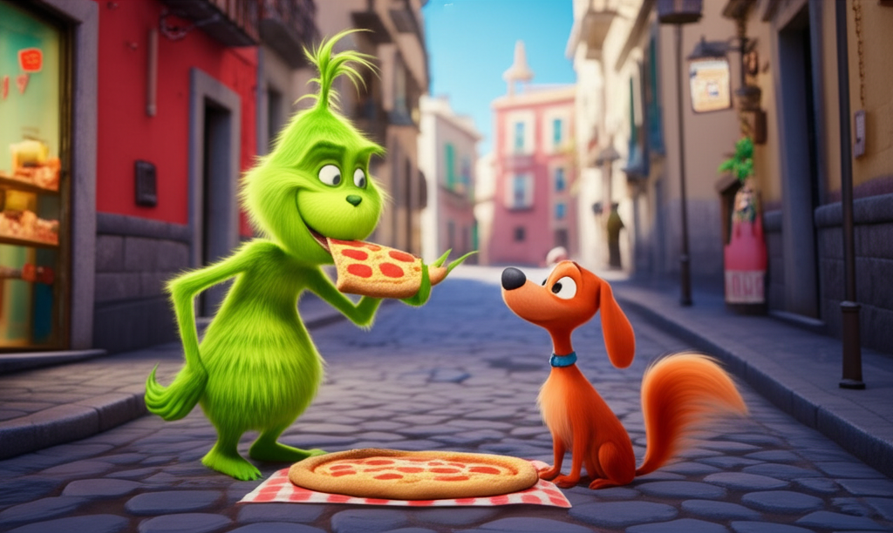
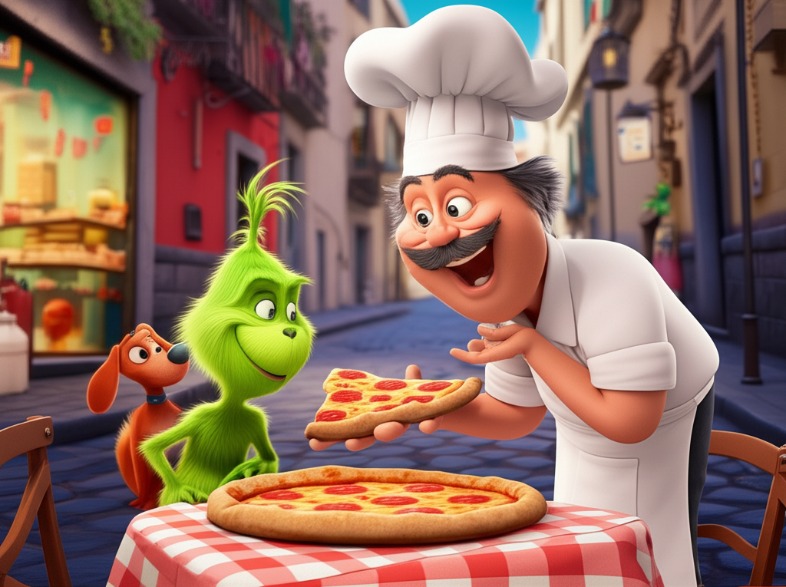
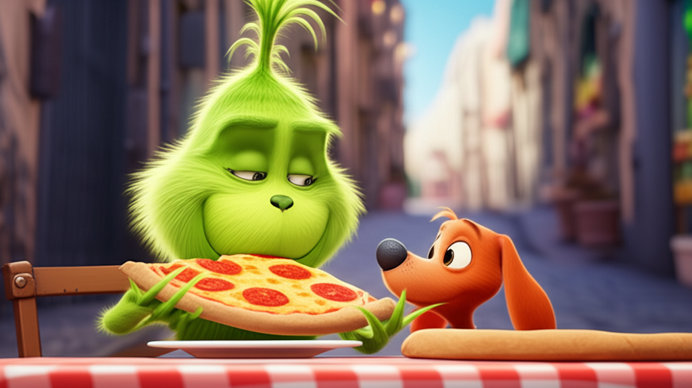
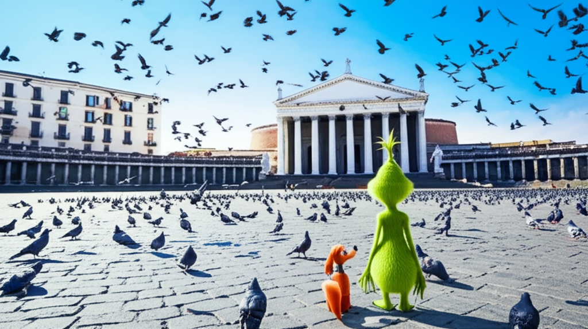

# Text&Image Story Generation Tool - 20250316-0938-grinch-pizza

**Prompt:** Generate a story about a cute little Grinch in a 3d digital art style, around Naples eating pizza with Max, his dog. For each scene, generate an image. 

## Chapter 1

## The Littlest Grump in Naples

**Scene 1:**

The Neapolitan sun shone brightly on a cobbled street, washing the colorful buildings in a warm glow. At a small, slightly wobbly, outdoor table sat a tiny Grinch. He couldn't have been more than knee-high to a regular person, with soft, slightly fuzzy green fur and surprisingly large, expressive yellow eyes that held a hint of their usual grumpiness, softened by the new surroundings. He wore a slightly oversized, patched-up red and white striped shirt. Across from him, panting happily with his tongue lolling out, sat Max, a scruffy but loyal dog with one ear perpetually flopped over. A half-eaten pizza, its crust charred and bubbly, lay between them on a checkered paper plate.

**Scene 2:**

A plump, mustachioed pizzaiolo with flour dusting his apron leaned over the table, a wide, welcoming smile on his face. He gestured animatedly with his hands as he explained something in rapid Italian, a fresh, steaming pizza held aloft. The little Grinch, despite understanding none of the words, watched with fascination, his frown momentarily replaced by curiosity. Max wagged his tail enthusiastically, his nose twitching at the delicious aroma of San Marzano tomatoes and melting mozzarella.

**Scene 3:**

The little Grinch took a big bite of his pizza, his small hands struggling slightly with the large slice. His eyes widened in surprise and a tiny, almost imperceptible smile flickered across his lips. The rich flavors of the tomato sauce, creamy cheese, and fragrant basil seemed to be working some sort of magic on the perpetually grumpy creature. Max nudged his leg gently, his own slice already devoured with gusto.

**Scene 4:**

Later, their bellies full and content, the little Grinch and Max strolled through the bustling Piazza del Plebiscito. Pigeons fluttered around their feet, and the sounds of laughter and music filled the air. The Grinch, surprisingly, didn't scowl at the joyous atmosphere. He even let out a small, almost cheerful sigh as he watched a group of children chasing after the pigeons, Max trotting happily by his side. Perhaps, just perhaps, the warmth of Naples and the magic of a good pizza were starting to melt even the grumpiest of hearts.

