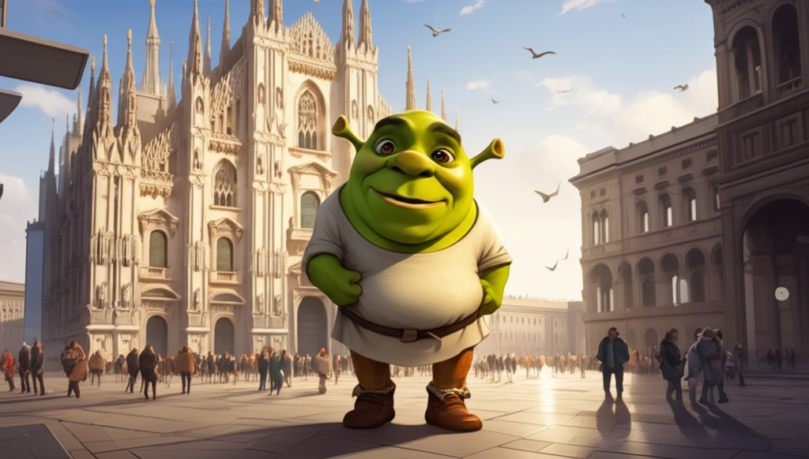
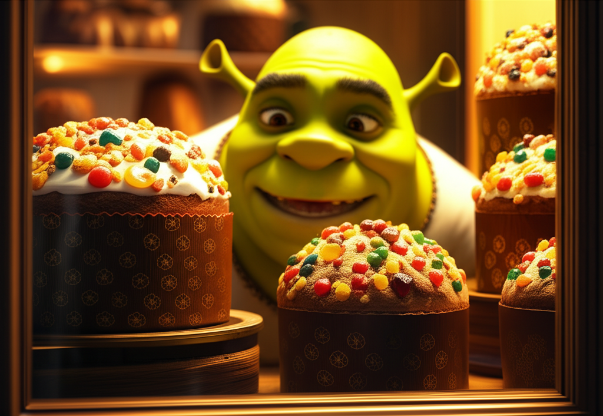
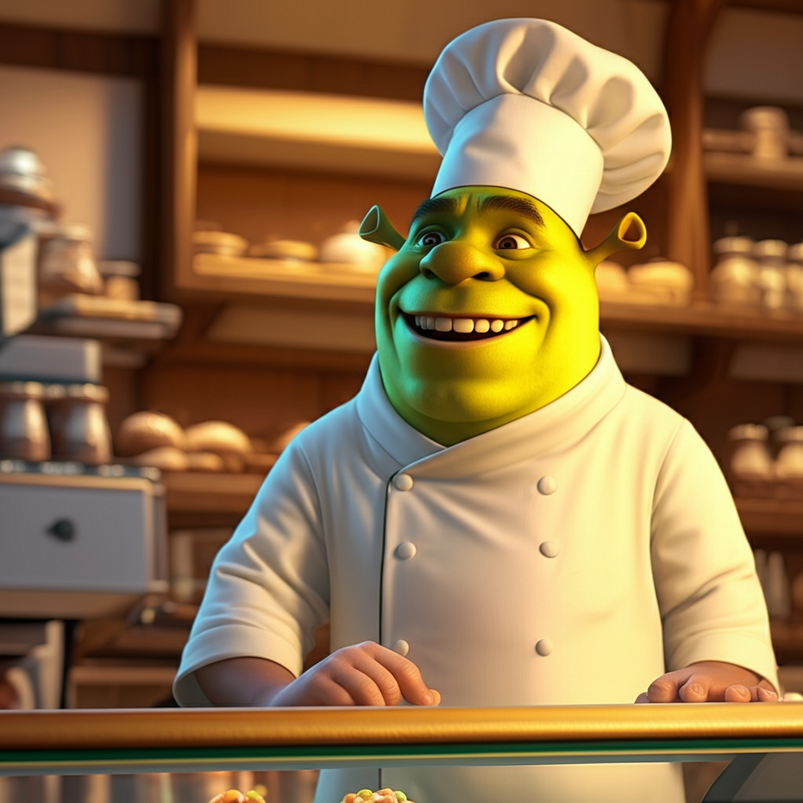
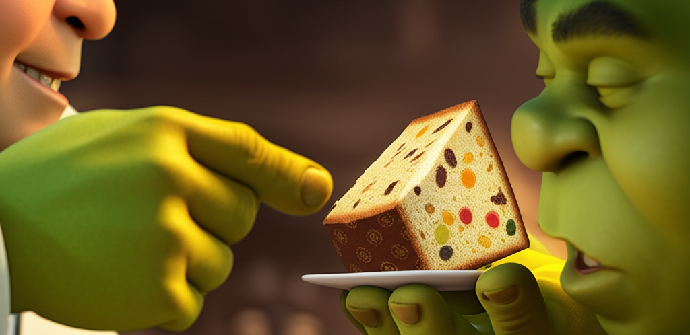
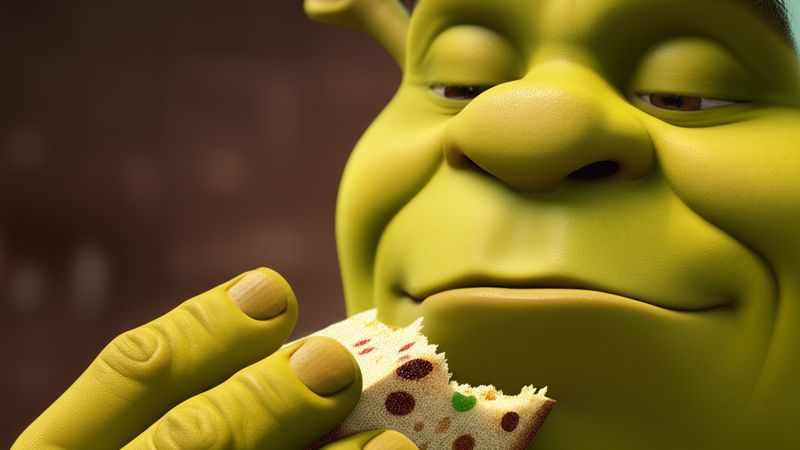
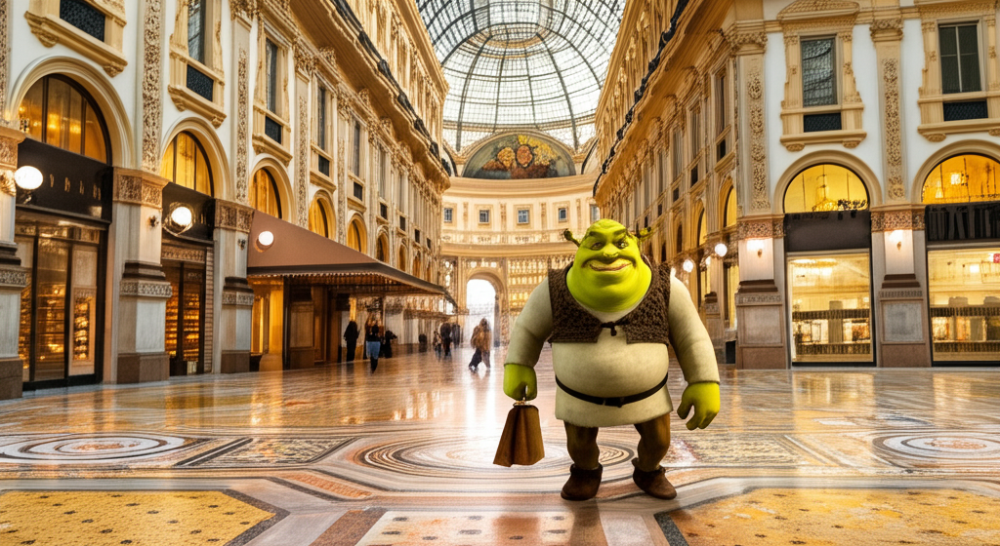

This story was written by Text&Image Story Generation Tool v1.5
* FOLDER_NAME: 20250316-1440-shrek-milan

* **Prompt**: Generate a story about a cute little Shrek in a 3d digital art style, walking around Milan and looking for the perfect Panettone. For each scene, generate an image. 

## Chapter 1

## The Little Ogre's Milanese Mission

**Scene 1:**

A wide shot of a sunny Piazza del Duomo in Milan. The majestic cathedral rises in the background, pigeons flutter around, and tourists mill about. In the foreground, waddling with surprising determination, is a miniature Shrek. He's about knee-high to an average person, his green skin gleaming slightly in the digital sunlight. He wears tiny brown boots and a determined frown creases his little brow. He clutches a small, hand-drawn map.

**Scene 2:**

Close-up on the little Shrek. He's peering intently at a window display of a charming pasticceria. Various Panettoni of different sizes and wrappings are stacked high, adorned with ribbons and candied fruits. His big, round eyes gleam with interest, but a hint of skepticism remains.

**Scene 3:**

Little Shrek is now inside the pasticceria. He stands on his tippy-toes, trying to see over the glass counter. A friendly-looking Italian baker with a flour-dusted apron smiles down at him. The air is thick with the sweet aroma of baked goods.

**Scene 4:**

The little Shrek is being offered a small slice of Panettone by the baker. He sniffs it cautiously, his nose wrinkling slightly. He examines the candied fruit and the airy texture with a critical eye.

**Scene 5:**

Little Shrek takes a bite of the Panettone. His eyes widen in surprise and then slowly close in delight. A small smile spreads across his face. The hustle and bustle of Milan fades as he savors the taste.

**Scene 6:**

Little Shrek is walking out of the pasticceria, carrying a rather large Panettone wrapped in festive paper. He looks incredibly pleased with himself, a triumphant grin on his face. He gives a small, appreciative nod to the baker waving from the doorway. In the background, the Galleria Vittorio Emanuele II gleams.

**Scene 7:**

The little Shrek is sitting on a small bench in a quiet Milanese park, the Sforza Castle visible in the distance. He has unwrapped his Panettone and is happily munching on a large slice, crumbs dusting his little green chin. He looks utterly content, having found the perfect taste of Milan.

