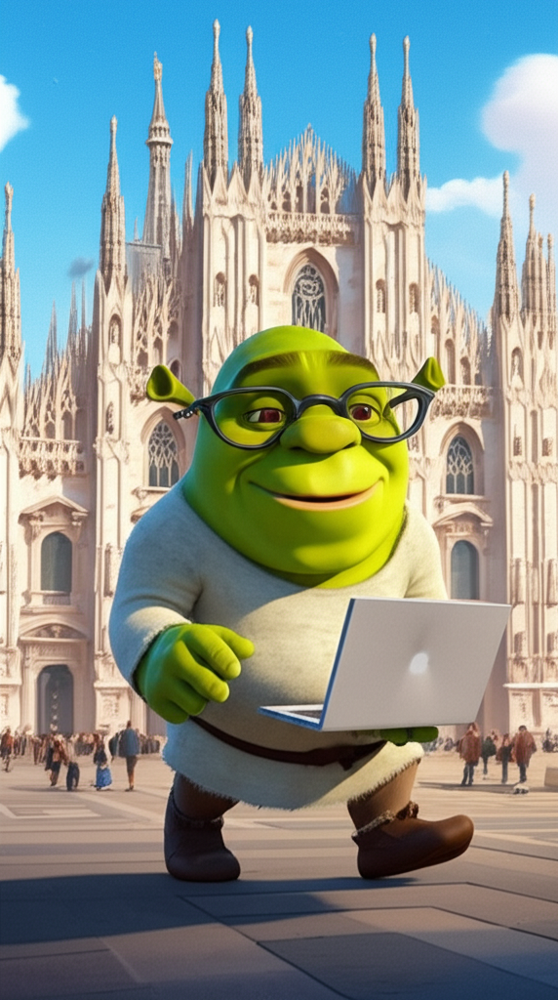
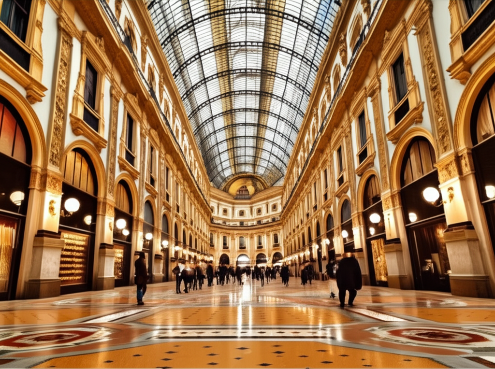
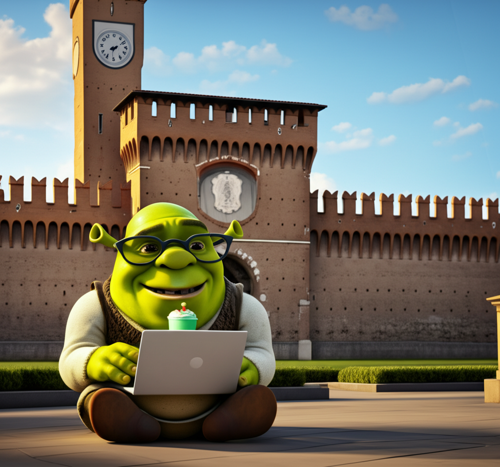
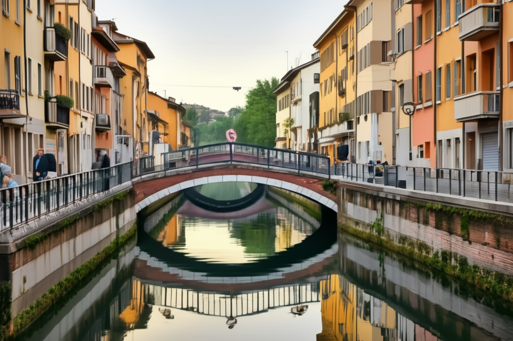
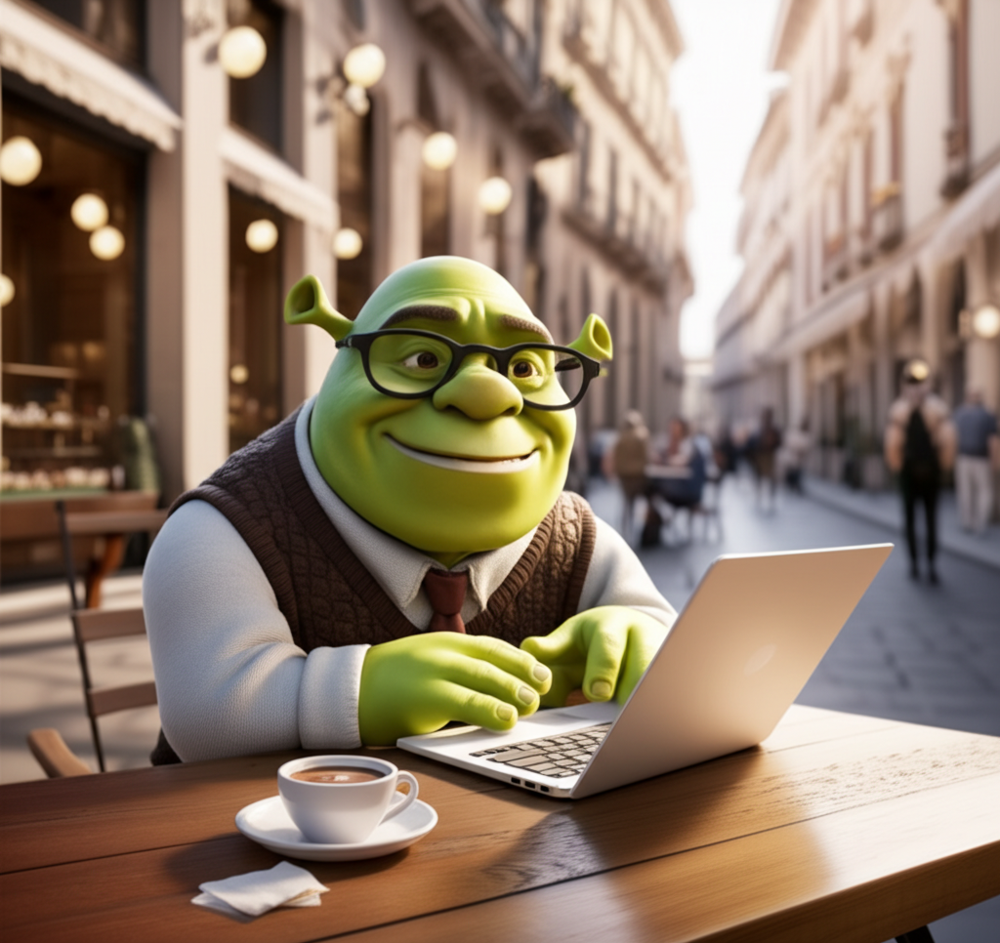
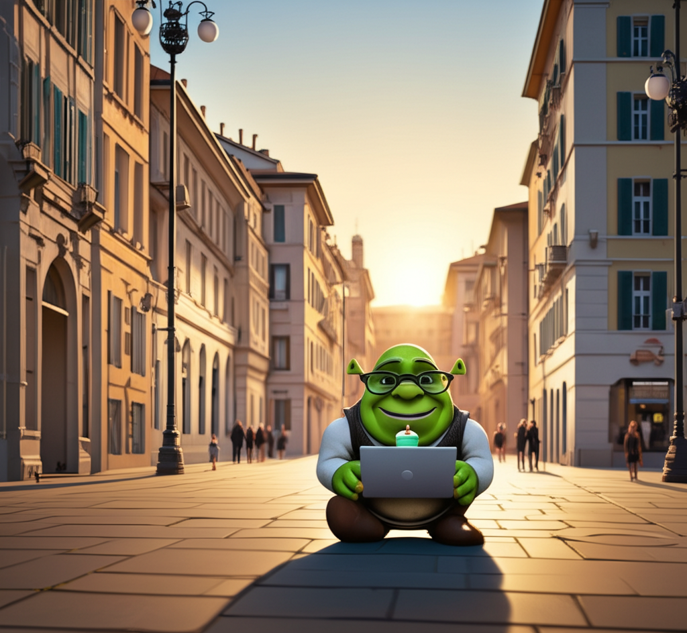

# Text&Image Story Generation Tool - 20250317-1244-shrek-milan-developer

**Prompt:** Generate an illustrated story about a cute little Shrek with glasses in a 3d digital art style, walking around Milan landmarks with his laptop. For each scene, generate an image. 

## Chapter 1

## Shrek in Milan: A Digital Adventure

**Our hero:** Meet Shrek, but not quite as you know him. This Shrek is… pint-sized! He’s still green, still has his iconic ears, but he’s adorably small and sporting a pair of stylish, round-rimmed glasses perched on his nose. He's also clutching a sleek, modern laptop under his arm, looking determined and a little bit out of his element.

---

**Scene 1: Arrival at the Duomo**

**Story:** Shrek blinked in the bright Italian sunlight, his little green face peering up at the colossal Duomo di Milano. "Whoa," he mumbled, his usual gruff voice surprisingly soft. He adjusted his glasses and consulted a digital map on his laptop screen, his brow furrowed in concentration. Pigeons fluttered around his tiny green feet, seemingly unfazed by the unusual tourist.

---

**Scene 2: Navigating the Galleria Vittorio Emanuele II**

**Story:** The ornate arches and glass ceiling of the Galleria Vittorio Emanuele II made Shrek's eyes widen behind his glasses. He carefully navigated the mosaic floor, his small boots clicking softly. He paused by a high-end boutique, peering at the window display with a mixture of curiosity and bewilderment. He quickly checked his laptop again, seemingly on a mission.

---

**Scene 3: Enjoying a Gelato near Sforza Castle**

**Story:** After his explorations, Shrek found a shady spot near the imposing Sforza Castle. He sat on a small bench, carefully balancing his laptop beside him, and happily slurped on a vibrant green gelato. A friendly street artist sketching nearby gave him a curious but amused glance. Shrek, lost in the deliciousness, didn't notice.

---

**Scene 4: Crossing a Canal in the Navigli District**

**Story:** The charming canals of the Navigli district were a change of pace. Shrek carefully stepped across a small bridge, his laptop securely under his arm. The reflections of the colorful buildings shimmered in the water below. He paused to take a quick photo with his phone (which he'd somehow managed to fit in his surprisingly small pocket), a thoughtful expression on his face.

---

**Scene 5: Working in a Milanese Café**

**Story:** Shrek found a cozy spot at a small table outside a bustling Milanese café. He had his laptop open, his little green fingers tapping away at the keyboard. He sipped on a tiny espresso, looking surprisingly focused amidst the lively chatter around him. Perhaps he was planning his next adventure, or maybe just catching up on emails from the swamp.

---

**Scene 6: Saying Goodbye to Milan**

**Story:** As the sun began to set, casting a warm golden glow over the city, Shrek stood in a picturesque piazza, his laptop now tucked safely into a small backpack. He looked back at the beautiful buildings, a small smile on his face. "Ciao, Milano," he whispered, a hint of fondness in his voice. This little ogre with glasses had certainly had an interesting day in Italy.

