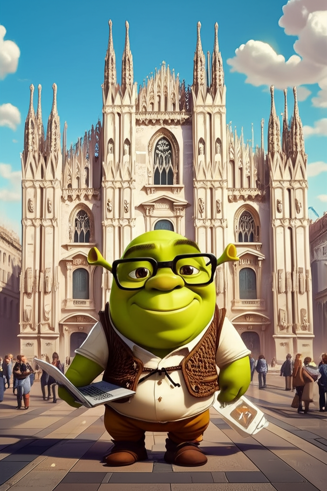
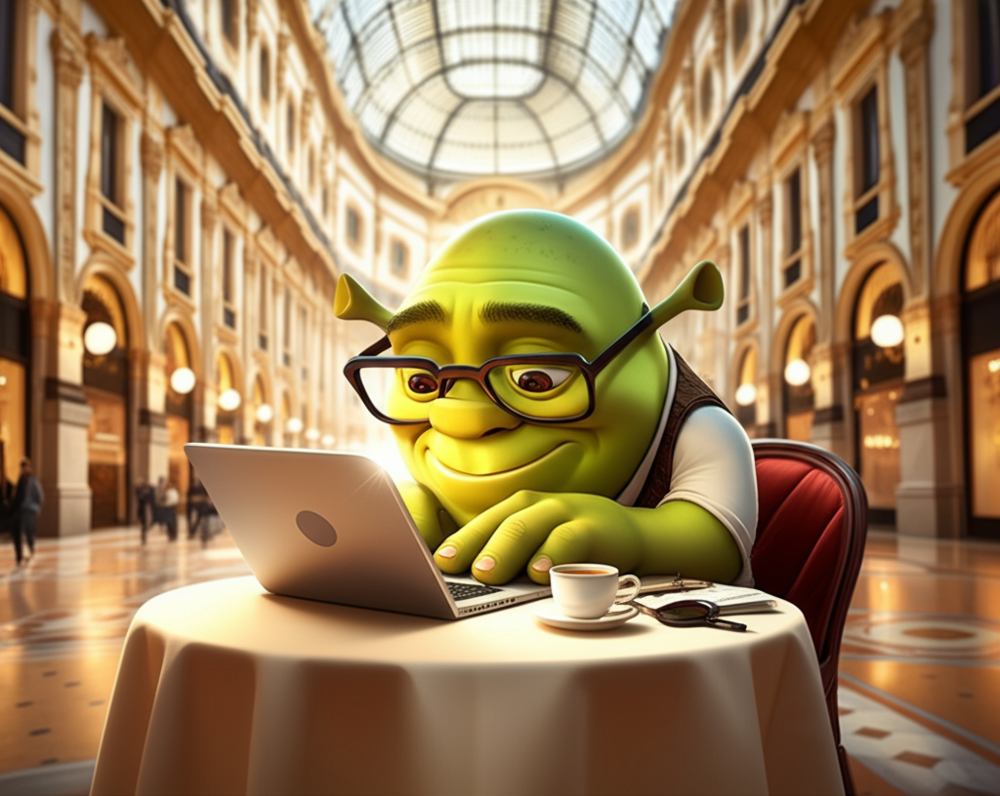
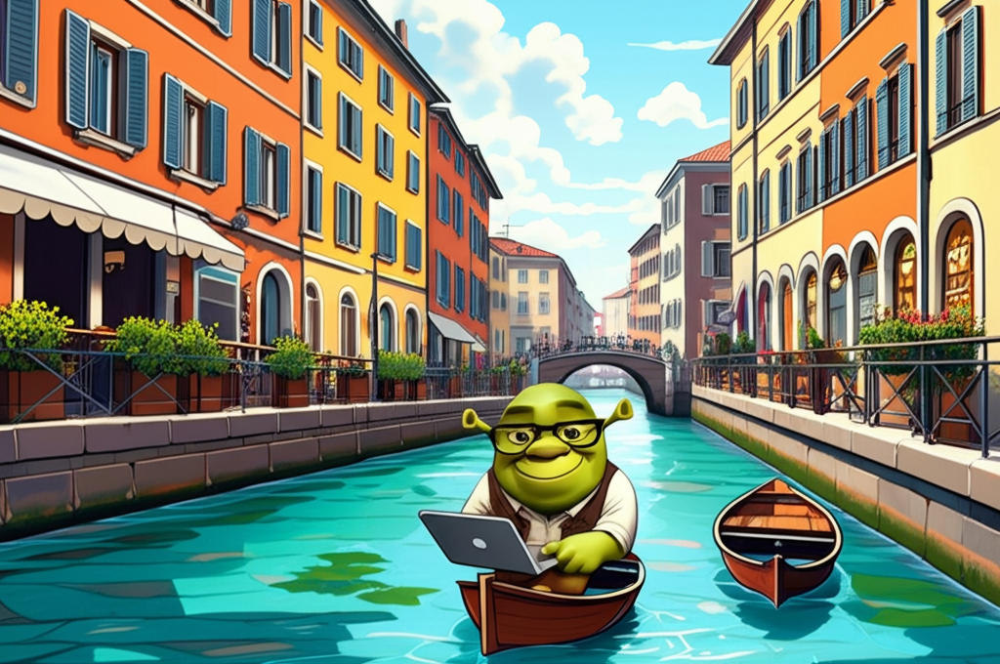
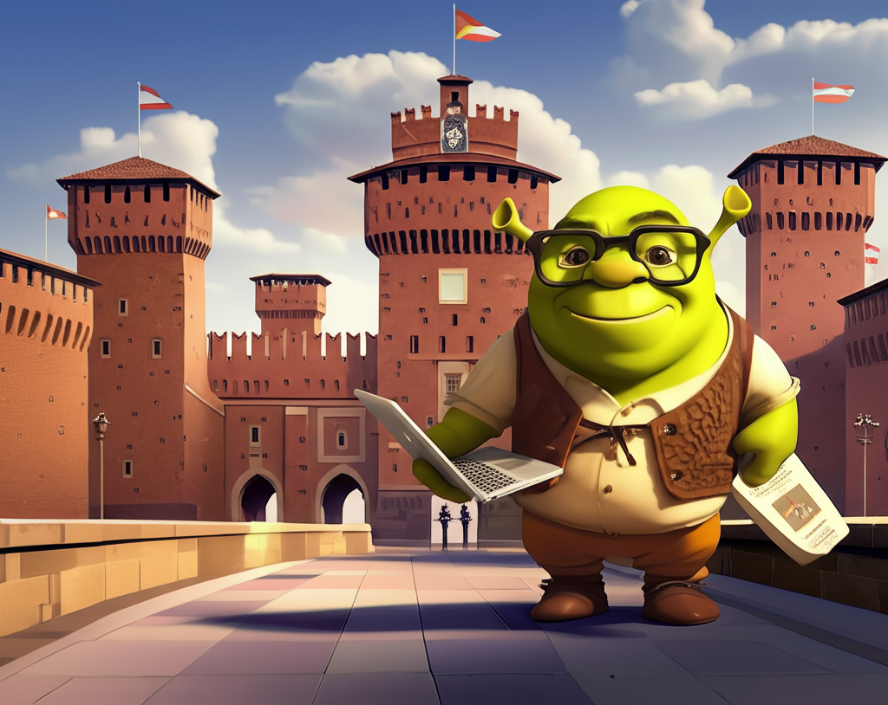
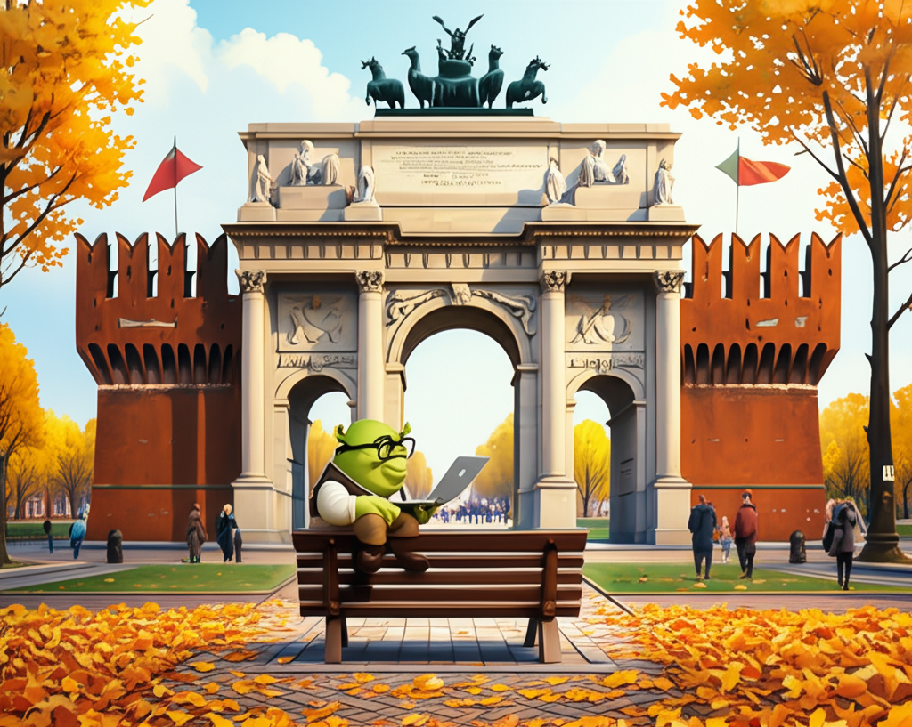

# Text&Image Story Generation Tool - 20250317-1245-shrek-milan-developer

**Prompt:** Generate an illustrated story about a cute little Shrek with glasses in a 3d digital art style, walking around Milan landmarks with his laptop. For each scene, generate an image. 

## Chapter 1

## Shrek in Milan: A Digital Story

**Our hero:** A surprisingly adorable, miniature Shrek with round, wire-framed glasses perched on his nose. He wears a tiny, neatly buttoned brown vest over his usual tunic. He carries a sleek, silver laptop under one arm, a determined glint in his emerald eyes.

---

**Scene 1:**

**Image Description:** A wide shot of a sunny Piazza del Duomo. In the foreground, little Shrek stands, slightly bewildered, looking up at the towering facade of the Duomo di Milano. His laptop is tucked securely under his left arm, and his little brown vest looks very dapper. Pigeons flutter around his slightly oversized green feet.

---

**Scene 2:**

**Image Description:** A close-up shot of little Shrek sitting at a small, outdoor cafe table in the Galleria Vittorio Emanuele II. He has his laptop open, and his brow is furrowed in concentration as he types. A tiny espresso cup sits beside the laptop. The ornate glass ceiling and mosaic floor of the Galleria are blurred in the background, hinting at the grandeur around him.

---

**Scene 3:**

**Image Description:** Little Shrek is walking along the Naviglio Grande canal. He's looking at his laptop screen, seemingly following a map or instructions. Colorful buildings line the canal in the background, and small boats are gently bobbing on the water. He seems a little lost but determined.

---

**Scene 4:**

**Image Description:** Little Shrek is standing in front of the Castello Sforzesco. He has his laptop tucked under his arm again, and he's taking a picture of the imposing castle with his other hand. He has a small smile on his face, as if he's finally reached his destination. Tourists can be seen in the background, also admiring the castle.

---

**Scene 5:**

**Image Description:** A charming shot of little Shrek sitting on a bench in Parco Sempione, his laptop open beside him. He's looking up at the Arco della Pace with a peaceful expression. A few fallen autumn leaves surround him on the bench. He seems to be taking a well-deserved break after his Milan adventure.

