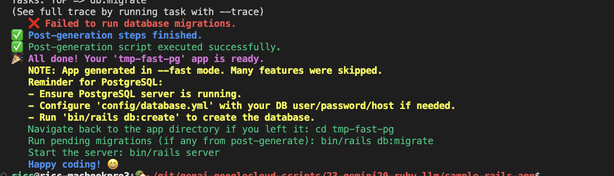

I love gemini! 

## G2.5exp prompt

help me create a script to generate a new sample-llm-app Rails application ensure its rails 8 or more (currently we have rails 8.0.2).
I want to generate an app in a local repo, so no git, use tailwind and add 2 gems to Gemfile (say foo and bar, then I'll edit). DB should be sqlite3. I might have to re-run it more times, so give me the proper tools to rerun it.

## iteration 2

this is absolutely FANTASTIC! Look, currently we're at rails 8.0.2 so no need to use RC or weird stuff. We can just use the latest rails. However, I'd like a small check which evrifies if it starts with 8. or more or dies.

Also, is there a way to make the generation SUPER fast? I'm thinking of:

- removing altogether tests and anything I dont need to get started.

- anything which takes unnecessary time (docs, --no-ri, --no-rdocs, ..)

I'd like to have a flag like --fast which I will use the first feww times for rapid prototyping and when it all works i'll remove it and get all goodies.
