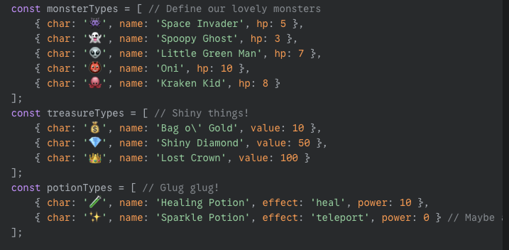
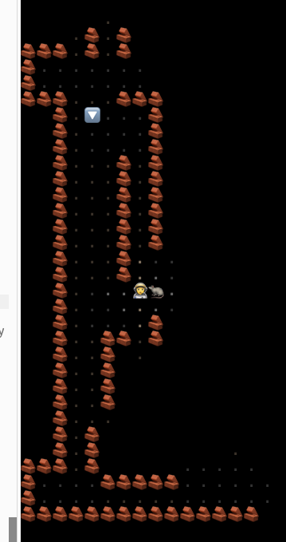

* Permalink: https://gemini.google.com/corp/app/659293b77c18ce65
* model: G2.5 pro exp.

## images

## Prompt

In the 80s there was a famous CLI game where you'd explore a dungeon with keyboard commands, you would use the keyboard for moving in the 4 direction, "Q" to quaff a potion, and so on.

I'd like you to create a p5js clone of that game with these features:

1. Adapt size to 100% of screen, wether its mobile or desktop. I want to play on FULL screen offered by my browser.
2. When you start, generate a dungeon with rooms which can vary in size from 2x2 (minimum) to say 5x8 / 8x5 max. There are corridors unifying these rooms. No corridor or room touches any other corridor or room, except the 2+ terminations of a corridors ending in a room (a corridor can unite 2 or more rooms).
3. You start in a random (empty) room. Visibility is radius of 2 or 3 (configurable on top as variable - lets start with 2). As you proceed, more parts become visible and they STAY visible (so every point of the dungeon must have a boolean which tells you if it was shown before).
4. Every dungeon has exactly one stair to the next dungeon.
5. Use emoji to signify monsters and my character, and make the dungeon room and corridors nice-looking (you probably need a few tiles for vertical horizontal and 4 border walls, both for the rooms and corridors). What you don't see is pitch black.
6. I'd like to have some easter eggs which you can call with the command "^". This opens a keyboard input where you can type a word. Some useful easter eggs will be:

    * "showoff": it shows the whole dungeon.
    * "killemall": kills all monsters of the whole dungeon, leaving the treasures.

7. Come up with some nice emoji monsters and treasures, and model to keep track of monsters HP and treasures. There will be potions. On the bottom you can see the current equipment and HP of the character. When HP reaches 0, its game over.

8. You can use the whole keyboard (A..Z) to come up with meaningful commands. Make sure to show them all with the key H(help).

Try to keep it all in a single javascript file.

## prompt 2

oh wow, this is AMAZING!

1. fewer monsters please, game is TOO hard. there should be 1 monster every 3 rooms, on average, and never on the first.

2. I dont like the "#" thingy.

3. Add a dragon monster, super big, which only appears on lower floors.

4. Create a XP (experience points) system so I level up, say every 5-10 onsters. You can be level 1-36 (max 36) and the XP level is exponential, 2000XP for L2, 4000 for L3, 8000 for L4 and so on. When you level up you have more HP per level and you do more damage. Also monsters should be getting stronger/different.

5. no space invaders., only things from the past please. Ogre, dragon, mouse, wolf, ... animals.
